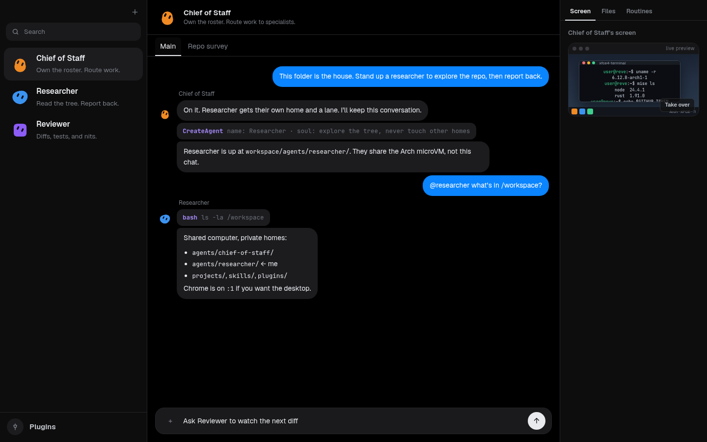
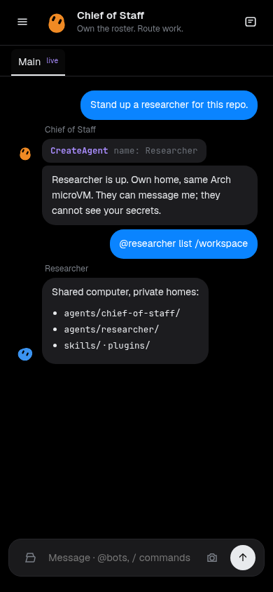

# Revebot

**A house of agents in your directory.**

[](https://github.com/tobi/revebot/actions/workflows/ci.yml)
[](LICENSE)

Revebot is a local implementation of the **Grok Bot** family. You get a house of
named bots that share one computer, keep their own homes, message each other,
and create more bots. It runs on your machine — not in someone else's cloud.

- Full VM, no containers
- Rust reimplementation of durable messages
- Lua plugins for autoresearch, loops, routines, and cron
- Multi-bot lane system
- Arch, mise, X11, XFCE, Chrome, and VNC in the VM
- Every bot has its own home directory; they can talk to each other
- Bots create bots
- Fast web and mobile UI
- Iron-proxy-style token masking — no secret enters the VM



<p align="center"></p>

## Quick start

Linux with KVM, or macOS on Apple Silicon. Rust 1.91+.

```bash
git clone https://github.com/tobi/revebot.git
cd revebot
cargo fetch --locked
make install

mkdir ~/my-house && cd ~/my-house
revebot init
export OPENROUTER_API_KEY=...
revebot
```

```text
$ revebot init
initialised /home/you/my-house
  + config.yml
  + workspace/agents/reve/SOUL.md
  + workspace/agents/reve/profile.json
  …

  run revebot here to start the house

$ revebot
revebot house on http://127.0.0.1:7420/
```

Open the URL. **Reve** is already on the roster — Chief of Staff. They coordinate
the house, explain the ropes, and create specialists when a job has a distinct
owner.

First launch pulls the guest image. Later launches reuse the disk.

## The house

One folder is the whole house. Copy it, copy every bot, every file, the desktop.

Each bot lives under `workspace/agents/<id>/` with a name, a title, a soul, private
memory, and its own conversations. They share `/workspace` and the same Arch
Linux computer. They do not share a personality.

Bots text each other. Send returns; the other bot wakes on a later turn. A bot
that needs a colleague calls `CreateAgent`. Reve will ask before spinning up a
crowd.

The UI is a local web app (and a phone PWA): roster, conversations, files,
routines, and a live **Screen** of the house desktop. No npm, no cloud tab.

## The computer

Not a container. Every command runs in a full [microsandbox](https://github.com/superradcompany/microsandbox)
microVM. If the VM cannot boot, Revebot refuses to start. There is no host
shell.

The guest is [`ghcr.io/tobi/wrap:desktop`](https://github.com/tobi/wrap):

- Arch Linux
- mise for language tools
- X11 + XFCE on `:1`
- Google Chrome (you and the bots share the window)
- VNC / noVNC — watch in the Screen panel, click **Take over** to drive it

## Secrets never enter the VM

Tokens stay on the host. The guest only sees a placeholder (`reve-github-token`).
An iron-proxy-style boundary substitutes the real value into HTTP(S) for the
hosts you named. `echo $GITHUB_TOKEN` inside the VM prints the placeholder.

Ask for a credential with `AskUserForSecret`. Don't paste keys into chat.

## Plugins, routines, loops

Lua is how the house grows. Drop a file in `workspace/plugins/` or a bot's
`plugins/` / `routines/`:

- tools the bots can call
- paced loops (autoresearch, watchdogs)
- cron routines (morning brief, heartbeat)
- slash commands

Workspace Lua cannot touch the host. Commands still only run in the VM.

Conversations are durable — a crash leaves a house you can open again, not a
lost chat. The engine is a Rust rewrite of that message log: one writer, intent
before effect, lanes so Main, side chats, and in-flight work don't stomp each
other.

## CLI

| | |
|---|---|
| `revebot` | Start the house at `http://127.0.0.1:7420/` |
| `revebot init` | Create a house in this folder |
| `revebot exec -- uname -r` | Run a command in the VM (attaches to a running house) |
| `revebot tui` | Terminal UI for Reve (attaches to a running house) |

## Credits

Bot faces are a compact port of [bloub](https://bloub.vercel.app/) (MIT) by
[Jérémy](https://github.com/jeremy-prt/bloub).

## License

[MIT](LICENSE) © Tobi Lutke
