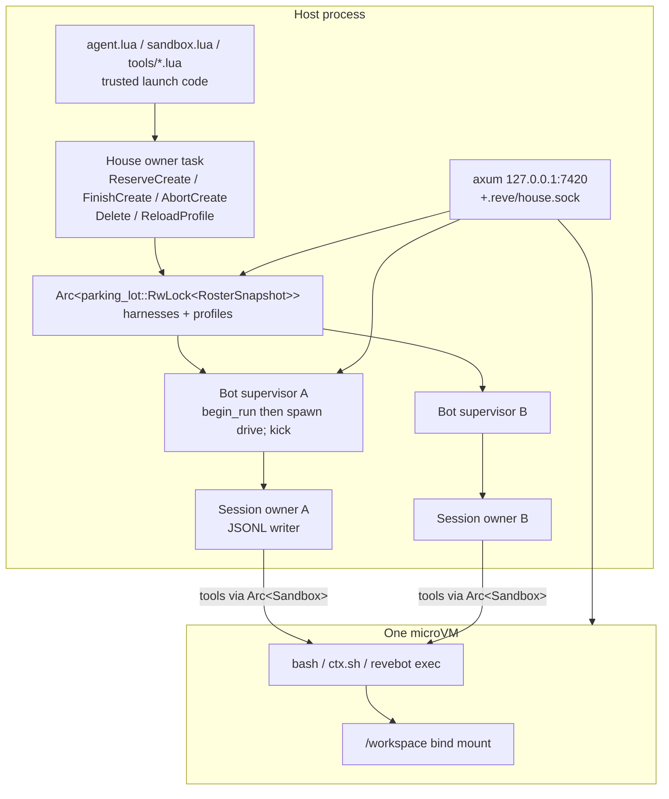
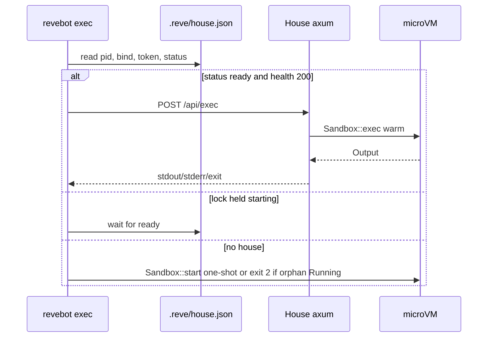

# Reve House: a local house of Grok-Bot-shaped teammates

| Field | Value |
|---|---|
| **Status** | Draft |
| **Author** | Reve design (placeholder) |
| **Date** | 2026-08-29 |
| **Product** | **revebot**: a house of bots. The engine remains the Reve harness (this repo). |
| **Binary** | `revebot` (`Cargo.toml` `name`, `[[bin]]`, `default-run`). No `reve` alias. Host state dir stays **`.reve/`**. |
| **Depends on** | `docs/harness.md` (authority), `docs/architecture.md` (map), `AGENTS.md` (hard constraints) |

---

## Overview

**Historical draft:** the Lua trust split and current APIs below have been superseded
by `docs/architecture.md` and `src/templates/plugins_skill.md`. Workspace Lua is now
bot-editable but restricted in a separate state; host-installed Lua remains trusted.
The planned tests/PR list here is not a claim that those behaviors are implemented.

Reve is already the right engine for a Grok-Bot-like product: a durable Rust harness, Lua as trusted launch code, a mandatory microsandbox microVM, and the philosophy that you inspect an agent with ordinary filesystem tools. What it is *not* yet is a house. Today `reve` with no subcommand boots the VM, **stops it**, and opens a single-agent ratatui TUI (`src/main.rs`). Identity files (`instructions.md`, `agent.lua`, `sandbox.lua`, `tools/*.lua`) live *outside* the VM mount, so the bot cannot self-edit the things that make it itself. There is one conversation, one session file under `.reve/sessions/`, and no way for a teammate to exist.

This design rearranges the loadout, not the engine, and ships it as the **`revebot`** command (crate and binary renamed; durable host state stays under `.reve/` because that is still the Reve engine's runtime). A house directory becomes a **house of bots**: one microVM, one shared `/workspace`, many bots. Each bot is a sibling folder under `workspace/agents/<id>/` with a profile, standing instructions, skills, its own JSONL session, and an optional per-bot `model`. The first bot is `chief-of-staff` (display name **Chief of Staff**): it already has a job — coordinate the house, ask how it can help, and `CreateAgent` specialists when a job has a distinct owner. `update_state` can still change the display name; the folder id does not move. Bots message each other asynchronously — send returns an ack, the target wakes later on a fresh turn with cue `[agent]`. The model's opening assistant text is the first user-visible bubble; after tools start, the UI shows Working… and further bubbles go through `SendUserMessage` in the same run. The default CLI starts a localhost HTTP+WebSocket server, keeps the VM warm, and refuses to serve if the microVM cannot boot. Lua launch code stays on the host, outside the mount, so a bot that can `write` its own `instructions.md` still cannot open the host door.

Runtime shape, in one sentence: **the House owner task mutates the roster and never awaits a run; each bot has a supervisor that claims (`steer` / `begin_run`) then `spawn`s `drive` / `kick`, and HTTP/TUI only wait on that claim oneshot.**

The aesthetic we are aiming at is opengrok's, not a chatbot-SaaS clone: local, one model per agent, keys never leave the machine, file-based roster, picker-simple UI, update-proof, "not farming you, arming you."

---

## Background & Motivation

### Current Reve (verified in tree)

| Fact | Where |
|---|---|
| Philosophy: "The directory is the agent." One portable directory, no machine-wide profile. | `README.md`, `src/project.rs` module docs |
| `reve init` templates: `agent.lua`, `sandbox.lua`, `tools/example.lua`, `instructions.md`, `models.yml`, `workspace/{AGENTS,SOUL,KNOWLEDGE}.md`, `workspace/HEARTBEAT.yml`, `.gitignore` | `src/project.rs` `TEMPLATES` |
| KEEP_DIRS: `tools`, `channels`, `workspace/knowledge`, `workspace/notes`, `workspace/skills` | `src/project.rs` `KEEP_DIRS` |
| Sessions: `.reve/sessions/{name}-{stamp}.jsonl` via `Project::conversation_path` / `latest_session` | `src/project.rs` |
| System prompt: root `instructions.md` + `workspace/{AGENTS,SOUL,KNOWLEDGE}.md` + skills catalog | `src/tui/session.rs` `system_prompt()` |
| Built-ins: `bash`, `read`, `write`, `edit`, `ls`, `glob`, `grep`. All in-VM; paths relative to `/workspace` | `src/tools.rs` `BUILTINS` |
| Harness surface: `prompt` / `steer` / `follow_up` / `next_run` / `abort` / `compact` / `navigate` / `resume` | `src/harness.rs` |
| Lane claim: one operation per lane; loser gets `HarnessError::Busy` | `src/harness.rs` `start()` |
| Queued input: `pending.entry/{id}` + id in the running op's inbox, one conditional transaction | `src/harness.rs` `enqueue()`; idle queue is `lane.state.pending_next_run` via `next_run()` |
| TUI compose dispatch: try `harness.steer`, on `Idle` `tokio::spawn(harness.prompt)`. `Action::FollowUp` (`&` / `/queue` in `src/tui/app.rs`) hits that **same** path — it is **not** `harness.follow_up`. `harness.next_run` is only `queue()` from a slash handler on text still starting with `/` | `src/tui/session.rs` ~294–320, ~449–457 |
| Single writer: `Storage` is not `Sync`; `Session::spawn` moves it into one owner task | `src/session.rs`, `docs/architecture.md` §0 |
| Transcript vs context: `Session::transcript` is the raw branch (UI); `Session::context` is the model window (drops aborted/error turns, stops at compaction) | `src/session.rs` |
| JSONL: exclusive `File::try_lock` (advisory), flush every append, torn tail discarded, malformed middle = corruption | `src/storage/jsonl.rs` |
| Sandbox: `microsandbox =0.6.8`; workspace bind at `/workspace`; **refuses** if namesake is `Running \| Draining` — never adopts a live VM | `src/sandbox.rs` `Sandbox::start` ~339–350 |
| Exec locking: `acquire()` holds `tokio::sync::Mutex<VmState>` only for lifecycle; clones the VM handle and increments `active`. Concurrent execs share the handle. Idle stop after 30s when `active == 0` | `src/sandbox.rs` `acquire` / `release` / `IDLE_TIMEOUT` |
| Bare `reve`: boot VM, `sandbox.stop()`, TUI, stop again | `src/main.rs` `run()` |
| Channels: `Hub` broadcast + namespaced KV at `.reve/channels.json`. Not a multi-bot bus | `src/channels.rs` |
| Lua host door closed: `os.execute`, `io.popen`, `os.exit`, `package.loadlib` deleted in `Runtime::new` | `src/lua.rs` `HOST_COMMAND_PATH` |
| Skills: `skills::discover(root)` walks `root.join("skills")`. TUI already passes `project.workspace()`, i.e. **`workspace/skills/`** (already in `KEEP_DIRS`). Only the per-bot union is new | `src/skills.rs`, `src/tui/session.rs` ~594, ~802 |
| Heartbeat: YAML load + response contract; **not wired** into the TUI/main loop | `src/heartbeat.rs` |
| No HTTP server (no axum/warp). TUI is ratatui in `src/tui/` | `Cargo.toml`, `src/lib.rs` |
| Binary name is `reve` | `Cargo.toml` `[[bin]] name = "reve"` |
| Lua tools shadow built-ins of the same name | `src/tools.rs` `schemas()` |
| `Sandbox::write_file` is `vm.fs().write` after `absolute()`; **no mkdir** | `src/sandbox.rs` ~548–557 |
| `FORMAT_VERSION = 4`; `COMPACT_DEAD_WRITES = 64` | `src/entry.rs`, `src/storage/jsonl.rs` |

Pain points this change is for:

1. **The bot cannot own its identity.** `instructions.md` sits at the project root, outside the bind mount. `read`/`write`/`edit`/`bash` cannot see it. Self-edit is a stated Reve value (`system_prompt` is "rebuilt per turn: the agent edits these files") that currently only applies to `workspace/*.md`.
2. **One teammate.** Grok Bot's product is a roster of durable jobs, not a single chat. Reve has the harness to run N sessions; it has no house to own them.
3. **The CLI puts the VM to sleep on purpose.** `src/main.rs` boots to fail closed, then `stop()`s so "idle TUI sessions coexist." That made sense for a terminal you might leave open. It is the opposite of a house whose `reve exec` should be cheap and whose bots should be able to wake each other.
4. **There is no user-facing surface except the TUI.** A house of bots needs a sidebar of names, a transcript per bot, and a "New agent" control. Ratatui can stay; it should not be the default.

### What we are copying, and what we are not

From the official Grok Bot product ([docs.x.ai/grok-bot/bots](https://docs.x.ai/grok-bot/bots)):

- A Bot is a durable teammate with a name, a job, its own conversation, working context over time.
- One shared computer; bots share files. Deleting a bot does not isolate shared computer files.
- Create via "Create new agent". First bot is named **New Agent**. Profile: name, title, description, avatar.
- Existing bots can create focused teammates. Cap ~50 bots. Ask before creating several.
- Description holds rules that remain true; the conversation holds the task.

From the reconstructed host (`b-nnett/grok-bot-0.18-reconstructed` `source/host/agents/agent-messaging.ts`):

- Tools: `SendToAgent`, `CreateAgent`, `UpdateAgent`, `update_state` (target "profile" for own name/description/persona), `SendMessage` (to the user).
- Messaging is **asynchronous like texting**: send returns an ack immediately; the target wakes later on a fresh turn with cue `[agent]`. You do not get a reply in this turn and must not poll.
- Discovering agents is file-based: sibling folders under `agentsRootDir`; `profile.json` (`name`, `description`, `title`, avatar fields); groups via `group.json` (out of v1).
- Agents cannot delete other agents (user can from the UI, with confirm).
- Fan-out requires user confirmation. Encode that judgment in instructions; v1 tools are 1:1.

From grok-bot-cli (`ScriptedAlchemy/grok-bot-cli`): `{uuid}/profile.json`, `memory/`, `automations/`, settings, under an agents root. We use **slugs** rather than UUIDs so the house stays inspectable (`workspace/agents/researcher/`, not `workspace/agents/3f2a…/`).

From opengrok (`OnlyTerp/opengrok`): local, one model per agent, keys never leave the machine, file-based, picker-simple UI, "not farming you, arming you." We take the aesthetic and the threat model, not the Grok-Bot-client patcher.

---

## Goals & Non-Goals

### Goals (v1)

1. Lift "the directory is the agent" to **"the directory is the house; each subdirectory under `workspace/agents/` is a bot."** Keep the inspect-with-filesystem-tools property.
2. Scaffold a first bot, `chief-of-staff` (name **Chief of Staff**), whose instructions ask how it can help and to create specialists when a job has a distinct owner.
3. Move bot identity (markdown, skills, sessions, profile) **inside** the VM mount so `read`/`write`/`edit`/`bash` can change it.
4. Keep Lua launch code (`agent.lua`, `sandbox.lua`, house `tools/*.lua`) **outside** the mount. The model must not edit them via workspace tools.
5. One microVM per house. All bots' `bash` / `ctx.sh` / `revebot exec` run in that guest. `/workspace` is the shared computer.
6. Many bots, cap 50. Closed tool set: `update_state`, `CreateAgent`, `UpdateAgent`, `SendAgentMessage`, `SendUserMessage`.
7. Async agent messaging with intent-before-effect: persist on the *target* session (`next_run`) before ack; wake via `Harness::kick` (new) on idle or on `RunEnd`. Crash between persist and wake still delivers.
8. Invert the default CLI: `revebot` with no subcommand boots the VM (fail closed), keeps it alive, serves HTTP+WS on `127.0.0.1:7420`. Land as `revebot serve` first, then invert. `revebot tui` stays.
9. `revebot exec` / `revebot tool` attach to the running house VM when one is up; otherwise one-shot as today. No second in-process VM owner. Dead-pid leftover VMs are taken over only by the house lock holder.
10. Per-bot model: `profile.json` `model` is honored; house `agent.lua` is the fallback when null/absent. Same `models.yml` catalog.
11. Opening assistant text is the first user-visible bubble; after the first tool call, Working…; `SendUserMessage` posts more bubbles in the same run.
12. Tests for every new behaviour. `cargo test` stays green. MicroVM tests stay opt-in.

### Non-goals (v1)

- Groups / group chats / `group.json`.
- A `reve` binary alias (one binary: `revebot`).
- Pixel-perfect Grok Bot UI, Electron, or a heavy frontend framework.
- ACP (`grok agent serve`) as the web protocol.
- Bots adding Lua tools (that would let a bot author host-side code). Fail closed; separate design if we ever want it.
- Bot-to-bot *delete*. Automations/routines UI. Pin/hide/duplicate/share-link from the Grok Bot product.
- Host-shell fallback of any kind, including "just this once so the server can start."
- Making `channels.rs` Hub the multi-bot bus (wrong shape: not durable, not per-session, not intent-before-effect).
- Wiring `heartbeat.rs` into the house scheduler (module exists, is unused; leave it, mention as future).
- Migrating existing `.reve/sessions/*.jsonl` into the first bot automatically.
- Auto-chaining `pending_next_run` inside `Driver::terminal` (see Alternatives). Kick lives on the supervisor.

---

## Proposed Design

### House vs bot

A house directory is a **house**. `revebot init` scaffolds it. `revebot` runs in it. Copy the directory and you copy the house — every bot, every shared file, the sandbox policy, the model catalog.

```
<house>/                              # `revebot init`; `revebot` runs here
├── agent.lua                         # HOUSE launch code: default model, thinking
├── sandbox.lua                       # HOUSE sandbox policy — one VM for the house
├── models.yml                        # HOUSE model catalog
├── tools/                            # HOUSE Lua tools (trusted; host-side)
│   └── example.lua
├── instructions.md                   # kept until the prompt builder reads the first bot
├── workspace/                        # VM bind mount at /workspace — the shared computer
│   ├── AGENTS.md                     # house kernel: how bots collaborate
│   ├── SOUL.md                       # optional house voice (shared)
│   ├── KNOWLEDGE.md                  # shared facts (first 100 lines still injected)
│   ├── HEARTBEAT.yml                 # unused by the house loop in v1; keep the file
│   ├── knowledge/                    # shared house facts
│   ├── notes/                        # shared notebook
│   ├── skills/                       # shared SKILL.md catalog, visible to all bots
│   └── agents/
│       └── <bot-id>/                 # one folder per bot; file-based roster
│           ├── profile.json          # name, title, description, avatar, model, created_at
│           ├── instructions.md       # standing instructions (self-editable)
│           ├── SOUL.md               # optional; this bot's voice, if it wants one
│           ├── skills/               # this bot's SKILL.md tree
│           ├── sessions/             # this bot's durable JSONL (gitignored)
│           └── memory/               # optional markdown the bot keeps (tracked)
├── .gitignore                        # `.reve/` plus `workspace/agents/*/sessions/`
└── .reve/                            # host-only durable runtime — not bot identity
    ├── sandbox-fingerprint
    ├── house.lock                    # exclusive flock; serve and tui both take it
    ├── house.json                    # pid, bind, sock, token, status, started_at
    └── house.sock                    # unix socket, same axum app as TCP (serve) / control-only (tui)
```

**Critical split.** Lua launch code stays **outside** the VM because it is trusted host configuration and Lua is not sandboxed (`src/lua.rs`: the body of a tool runs on the host; only `ctx.sh` enters the guest). Markdown identity, skills, profile, and sessions move **inside** `workspace/` so bots can self-edit with existing tools. If we later want bots to add Lua tools, that is a separate, fail-closed design: a bot must never be able to `write` `sandbox.lua` / `agent.lua` / `tools/*.lua` via the workspace mount. Out of v1.

Root `instructions.md` remains a template **until the prompt builder reads the first bot** (PR 3a). Dropping it in PR 1 would leave the still-default TUI with no standing instructions (`system_prompt()` today reads the house root). After the builder switches, new inits stop writing it; `Project::is_agent_dir` continues to accept `agent.lua` **or** `instructions.md` so an old checkout still loads.

`Project::sessions_dir` / `conversation_path` / `latest_session` move from `.reve/sessions/` to `workspace/agents/<id>/sessions/`. `.reve/` keeps VM disk, fingerprint, locks, and the house control files.



### First bot

- **Id / slug:** `chief-of-staff`. **The folder id is immutable after create.** `update_state({ "name": "Ada" })` changes the display name, not the path. The onboarding template must say so.
- **profile.json `name`:** `Chief of Staff`.
- **title:** empty string. **description:** `Own the roster. Route work to specialists. Create a focused bot when a job has a distinct owner. Ask before creating several.` **`avatar`:** JSON `null` (cleared).
- **instructions.md:** Chief of Staff standing orders, not a blank persona. See [Onboarding](#onboarding-first-bot).
- `revebot init` creates this bot. Re-init is idempotent: matching files `unchanged`, edited files `changed` and kept, missing files created. Same `InitReport` contract as today (`src/project.rs` `init`).

### Shared computer (one VM)

One `Sandbox` per house, not per bot. Constructed once at House boot from `project.runtime.policy`, `project.workspace()`, `project.state_dir()` — the same arguments `start_sandbox` in `src/main.rs` uses today.

- All bots' `Toolbox` values hold the same `Arc<Sandbox>`.
- `/workspace` is the shared computer. Durable project files belong there. Each bot has its own conversation/screen.
- **Refuse to start the HTTP server if the VM cannot boot.** Bind is last. See [Boot, lock, takeover](#boot-lock-and-orphaned-vm-takeover).
- `Sandbox::start` **does not** take over a live namesake (`Unavailable` if `Running | Draining`). Takeover is a separate, pid-gated stop-then-start. See below.

**Idle shutdown.** Today `IDLE_TIMEOUT` is 30s and `release()` stops the VM when `active == 0`. That is correct for one-shot `revebot exec`. It is wrong for a house (or TUI) whose next `revebot exec` should be cheap.

v1: the process that holds `.reve/house.lock` (serve **and** tui) holds a **lease** — `Sandbox::hold()` that keeps `VmState.active >= 1` without being an in-flight command. Drop restores the 30s timer. Do not delete idle shutdown; gate it on the lease. Tests: `hold_prevents_idle_stop`; `drop_without_house_restores_30s`.

**Concurrency of `bash`.** `acquire()` does **not** hold the mutex across `exec`. Multiple bots issuing `bash` at once is already allowed at the sandbox layer.

What *is* serial:

- VM start/stop (the mutex).
- Tool calls **inside one lane** (deliberate cut, `docs/architecture.md` §4: "Sequential tool execution only").
- One operation per lane per bot (`HarnessError::Busy`).

v1 accepts that. N bots can run concurrently (N harnesses, N session owner tasks, N supervisors), and their guest commands can overlap, but a single bot still runs one tool at a time. Provider rate limits are the more likely ceiling.

### Session ownership and who drives a run

Each bot has its own Reve `Session` (JSONL under `workspace/agents/<id>/sessions/`). One owner task per session, created by `Session::spawn` (`src/session.rs`). `Storage` stays un-`Sync`. Do not wrap it in `Arc<Mutex>`. Do not hand out `&mut Storage`.

A **House** process:

- owns the `Sandbox` and the idle lease
- owns `.reve/house.lock`, the HTTP/WS server (serve) and/or the unix control socket (tui)
- owns a **roster owner task** whose job is *only* roster mutations
- never writes another bot's JSONL except through that bot's `Session` handle
- is **not** a second writer of any session

**The House owner must not await `harness.prompt` / `run` / `kick` / `Sandbox::exec`.** `Harness::prompt` is `start_run` + `drive` (`src/harness.rs` ~121–132) and does not return until the model finishes. A house tool (`SendAgentMessage`, `CreateAgent`) must round-trip to persist on the target or reserve a sibling. If the owner is blocked inside the source bot's `prompt()`, that round-trip never runs → deadlock.

Copy `Session::spawn`'s actual constraint: the owner commits and reads; it never awaits a provider. The owner **may** await `Storage::open` / `Session::spawn` / `Harness::new` (host, no guest, no tool invoke). Guest `exec`/`write_file` for CreateAgent stay on the **caller** (tool or HTTP) after a slug reservation — see two-phase Create.

```rust
// Roster owner — final enough to implement against. Lives in src/house/mod.rs.
pub struct House {
    tx: mpsc::Sender<HouseCommand>,
    snapshot: Arc<parking_lot::RwLock<RosterSnapshot>>, // sync; system_prompt cannot await
    sandbox: Arc<Sandbox>,
    lock_file: File, // .reve/house.lock; retained for process lifetime (Drop releases flock)
}

pub struct RosterSnapshot {
    pub bots: HashMap<BotId, BotSlot>,
}

pub enum BotSlot {
    Creating { id: BotId, profile: Profile, reserved_at: Instant },
    Ready {
        id: BotId,
        profile: Profile, // includes Option<String> model
        harness: Arc<Harness>, // Mutex<Arc<dyn Model>> swapped on ReloadProfile
        session: Session,
        supervisor: SupervisorAddr,
    },
}

enum HouseCommand {
    /// Cap + slug. Inserts `BotSlot::Creating`. Does not touch the guest.
    ReserveCreate { spec: CreateSpec, reply: oneshot::Sender<Result<Profile, HouseError>> },
    /// `Storage::open` + `Session::spawn` + supervisor. Replaces `Creating`.
    /// Refuses unless the host can parse `workspace/agents/<id>/profile.json`
    /// (bind-mount `std::fs` read, not guest exec).
    FinishCreate { id: BotId, reply: oneshot::Sender<Result<Profile, HouseError>> },
    /// Drop the slot **only if it is still `Creating`**. Ready and missing
    /// both reply `Ok` (no-op). Does not rm workspace. Fire-and-forget ok
    /// (`try_send` from a `Drop` guard). After `FinishCreate`, a late Drop
    /// must not unregister the live bot.
    AbortCreate { id: BotId, reply: oneshot::Sender<Result<(), HouseError>> },
    Delete { id: BotId, reply: oneshot::Sender<Result<(), HouseError>> },
    ReloadProfile { id: BotId, reply: oneshot::Sender<Result<Profile, HouseError>> },
    Shutdown { reply: oneshot::Sender<()> },
    // No Prompt. No Exec. No Deliver. No Abort. No Subscribe.
}
```

**Roster rule (one line, every consumer):** anything that is not `ReserveCreate` / `FinishCreate` / `AbortCreate` / the sweep sees **Ready only**. `Creating` is the same as unknown: `not_found` / tool error `"unknown to"`. That covers the teammate prompt (cap 40), `SendAgentMessage`, `UpdateAgent`, `GET /api/bots`, `GET /api/bots/:id`, `DELETE`, and any `Arc<Harness>` lookup. Cap counting for *new* reserves still includes Creating (a reserved slug occupies a slot). Snapshot helpers:

```rust
impl RosterSnapshot {
    fn ready(&self, id: &BotId) -> Option<&ReadyFields> { /* Ready only */ }
    fn ready_profiles(&self) -> Vec<Profile> { /* Ready only, for prompts + GET /api/bots */ }
}
```

`ReserveCreate` refuses if `bots.len()` (Creating + Ready) ≥ 50, or if the allocated slug is already `Creating` or `Ready`. Two concurrent creates serialize here: first gets `researcher`, second `researcher-2`. Test: `concurrent_creates_get_researcher_and_researcher_2`. Tests: `abort_create_after_finish_create_leaves_the_bot`; `teammate_prompt_during_inflight_create_does_not_name_the_slug`.

**Creating is RAM-only.** A process crash drops every `Creating` slot. Boot scan loads a parseable `profile.json` as Ready (so a crash after successful `write_file` recovers the bot) and ignores a directory without one.

**Owner sweep:** every few seconds, `AbortCreate` any `Creating` whose `reserved_at` is older than **30s**. Backstop if a `Drop` guard's `try_send` is lost. `GET /api/bots` lists **Ready only** — a leaked `Creating` is not a bot the user can DELETE, which is why the sweep exists.

**Caller `CreateGuard`:** after `ReserveCreate`, the tool/HTTP future holds a guard that `try_send`s `AbortCreate` on `Drop` unless it marked `finished` after a successful `FinishCreate`. That covers `CancelRx`, panic, axum disconnect, and `Replay::Never` interrupted invoke. **Must** `AbortCreate` on any path other than `success && !cancelled` guest I/O **plus** `FinishCreate`. `Sandbox::exec` on cancel returns `Ok(Output { cancelled: true })`, not `Err` (`src/sandbox.rs` ~518–526) — treat cancelled (and non-zero exit) as failure; do not `FinishCreate`.

HTTP handlers and house tools hold `SupervisorAddr` / `Arc<Harness>` from **`ready()`** plus a clonable `House` for roster commands. They must **not** call `prompt()`, `begin_run()`, or `drive()` themselves. A lookup that finds only `Creating` is `not_found`.

`system_prompt` and teammate lists read `ready_profiles()` under **`parking_lot::RwLock`** (already in `Cargo.toml`; same crate the TUI uses). Not `tokio::sync::RwLock` — `HarnessConfig.system_prompt` is `Fn() -> String` invoked from the driver (`before_run` in `start_run` / `kick`) and cannot `.await`. Reads clone `Profile`s under a short guard. An in-flight `CreateAgent` slug does not appear in the directory until `FinishCreate`.

Each bot uses lane `"main"` (`entry::MAIN_LANE`). Cross-bot concurrency is N sessions, not N lanes in one session.

#### Per-bot supervisor

One task per bot, spawned when the bot is registered. **It is the only production caller of `drive`.** Axum and the TUI send `UserText` and wait for the claim oneshot; they never call `Harness::prompt` (that is start+drive and cannot produce a 202).

Publish two harness methods so the supervisor is not reaching into private `start_run`:

```rust
impl Harness {
    /// Claim only. Sibling of `start_run`. Returns `Current` (contains `OpId`).
    /// Does not drive. After a successful claim, emits `Kind::RunStart`
    /// exactly as `start_run` does (`src/harness.rs` ~428–432). HTTP/TUI
    /// must not call this; the supervisor does.
    pub async fn begin_run(self: &Arc<Self>, lane: &str, text: &str) -> Result<Current>;

    /// Drive a claimed `Current` to a terminal result. Public so the supervisor
    /// can `tokio::spawn` it. Production callers: this bot's supervisor only
    /// (`UserText` idle path, and `kick`).
    pub async fn drive(self: &Arc<Self>, current: Current) -> Result<OperationResult>;

    /// Inject a message the run should see at its next checkpoint.
    /// Returns the pending entry id **and** the `OpId` of the operation
    /// `enqueue` restored — do not re-read `lane.state.current_operation_id`
    /// afterwards (`Driver::terminal` can clear the claim in between).
    pub async fn steer(&self, lane: &str, text: &str) -> Result<(EntryId, OpId)>;
}
```

`steer` today returns only `EntryId` (`src/harness.rs` ~224–226); `enqueue` already has `op` at the successful commit (~560–598). Extend it (or a `SteerResult`) so the supervisor never `expect()`s a later register read.

Supervisor commands:

```rust
enum SupervisorCmd {
    UserText {
        text: String,
        reply: oneshot::Sender<Result<(Mode, OpId, Option<EntryId>), HarnessError>>,
    },
    Abort,
    KickNow,
}
enum Mode { Steer, Prompt }
```

Closed loop (UserText has no panic, one Busy retry; tests named in prose below):

```
loop {
  select {
    cmd = rx.recv() => match cmd {
      None => break,
      Some(SupervisorCmd::UserText { text, reply }) => {
        match harness.steer("main", &text).await {
          Ok((entry, op)) => {
            // Even if the lane is now idle (run terminated after the steer
            // commit), 202 with this op + entry. Do not read
            // current_operation_id. Do not expect().
            let _ = reply.send(Ok((Mode::Steer, op, Some(entry))));
          }
          Err(HarnessError::Idle(_)) => match harness.begin_run("main", &text).await {
            Ok(current) => {
              let op = current.operation.operation_id.clone();
              let _ = reply.send(Ok((Mode::Prompt, op, None)));
              let h = harness.clone();
              tokio::spawn(async move { let _ = h.drive(current).await; });
            }
            Err(HarnessError::Busy(_)) => {
              // Concurrent kick claimed the lane. Retry steer once.
              match harness.steer("main", &text).await {
                Ok((entry, op)) => {
                  let _ = reply.send(Ok((Mode::Steer, op, Some(entry))));
                }
                Err(e) => { let _ = reply.send(Err(e)); } // Idle → 409; do not loop
              }
            }
            Err(e) => { let _ = reply.send(Err(e)); }
          }
          Err(e) => { let _ = reply.send(Err(e)); }
        }
      }
      Some(SupervisorCmd::Abort) => {
        let _ = harness.abort("main").await;
      }
      Some(SupervisorCmd::KickNow) => spawn_kick(&harness),
    }
    event = events.recv() => match event {
      Ok(ev) if matches!(ev.kind, Kind::RunEnd { .. }) => spawn_kick(&harness),
      Err(RecvError::Lagged(_)) => {
        // broadcast capacity 1024; TUI already swallows Lagged
        // (src/tui/session.rs ~360). Do not depend on seeing every RunEnd.
        if pending_next_run_nonempty(&harness) { spawn_kick(&harness); }
      }
      Err(RecvError::Closed) => break,
      _ => {}
    }
  }
}

fn spawn_kick(harness: &Arc<Harness>) {
  let h = harness.clone();
  tokio::spawn(async move { let _ = h.kick("main").await; }); // Busy → ignore
}
fn pending_next_run_nonempty(harness: &Harness) -> bool {
  // point read of lane.state, not a history scan
}
```

Tests (prose, not inside the listing): `steer_then_terminal_still_202s_with_entry_id` (no supervisor panic); `begin_run_busy_retries_steer_once`; `kick_on_lagged_if_pending_next_run`.

Which task calls `drive`: the **bot supervisor** (or a task it spawned). After `begin_run` it replies, then `spawn(drive)`. `kick` claims then `drive`s inside the spawned kick task — still supervisor-owned. HTTP never drives.

TUI v1 talks to **one selected bot**. Same keybindings as today (`!` → `Sandbox::exec` on the shared VM, still no host shell; `/tool`, `/queue`, `/compact`). After PR 3b, compose is `UserText` to that bot's supervisor (same steer-else-`begin_run` path as HTTP). Switching bots is out of TUI v1. `!` / `/tool` stay side commands with their own `CancelRx`, as today.

### `Harness::kick` and `Harness::place_idle`

`next_run` persists `pending.entry` + `lane.state.pending_next_run` and is legal idle *and* busy (`src/harness.rs` ~242–276). Nothing in `Driver::terminal` or `resume_all` starts a new run because that queue is non-empty. TUI `/queue` is "wait until the user prompts again." Grok-Bot "wakes later" is not that.

`start_run` requires a non-empty `prompts` vec and *also* prepends existing `pending_next_run` onto `inbox.writes`. Idle path "`next_run` then `start_run` with a second `[agent]` cue" **duplicates** the inbound message.

**New public surface** (implement in PR 3b; used by PR 5). Record in `docs/architecture.md` in the same change. Not a cut of `docs/harness.md` — it is the missing "start a run from already-reserved next_run ids."

```rust
impl Harness {
    /// If idle and `pending_next_run` is non-empty: claim the lane with
    /// `inbox.writes = those ids` (do not mint a second prompt, do not rewrite
    /// `pending.entry` for them). Drive. If busy: `Err(Busy)`. If idle and
    /// empty: `Ok(None)`.
    ///
    /// `kick` is a sibling of `start_run`, not a wrapper of `start()`.
    /// Do not call `start()` or `start_run()`: `start()` always prepends
    /// current `pending_next_run` onto `inbox.writes` (`src/harness.rs`
    /// ~465–478) and would duplicate those ids (second place finds no
    /// register → `Corrupt`). Copy the claim+`drive` shape; fork the claim
    /// transaction. Parameterizing `start()` is a later refactor, not v1.
    pub async fn kick(self: &Arc<Self>, lane: &str) -> Result<Option<OperationResult>>;

    /// Place a conversation entry on an idle lane in one conditional
    /// transaction: mint id, parent = current leaf, write the entry, move the
    /// leaf. No `op.state`. If the lane is running: `Err(Busy)` — caller uses
    /// `write_entry`. Does not start a model turn.
    pub async fn place_idle(&self, lane: &str, entry: PendingEntry) -> Result<EntryId>;
}
```

`kick` algorithm:

1. `ensure_lane`. Read `lane.state`.
2. If `current_operation_id` is `Some` → `Err(Busy)`.
3. If `pending_next_run` is empty → `Ok(None)`.
4. Load those pending payloads (point lookup of `pending.entry/{id}`, not a history scan).
5. Run `before_run` on those payloads (hooks still see the turn). Hook-added messages get **new** ids; existing ids are not reminted.
6. One conditional transaction on `lane.state`: claim with `Intent::Run { prompt_entry_ids: existing ++ hook ids }`, `inbox.writes` the same, `phase: Checkpoint(need_assistant(last id))`, clear `pending_next_run`. Extra writes: only hook-new `pending.entry` rows. **Do not call `start()`.** After a successful claim, emit `Kind::RunStart` exactly as `start_run` does (`src/harness.rs` ~428–432). The TUI working indicator and WS clients key off that (`src/tui/session.rs` ~370).
7. `restore` the claimed `Current` + `drive` (same `drive` the supervisor uses after `begin_run`).

`resume_all` keeps emitting `Kind::RunResume` (unchanged). New claims (`begin_run`, `kick`) emit **`RunStart`**, not `RunResume`.

Boot per bot: `resume_all` then `kick("main")`. Do not scan history. If a run is suspended, `resume_all` drives it; `RunEnd` then `kick`s. If idle with queued ids, `kick` starts them. Test: `kick_after_next_run_emits_run_start_before_first_generation`.

**Do not** auto-chain inside `Driver::terminal`. Terminal already has one job (delete op registers, write `lane.lastResult`, clear the claim). Kick on `RunEnd` in the supervisor keeps "who starts a run" in one place.

`place_idle` is the idle path for `SendUserMessage`. It is harness placement, not a House raw `Session` commit, so seq/parent/leaf stay on the lane mutation line. Tests: seq increases, parent is the previous leaf, leaf moves, no `op.state` left behind. Record as new harness surface in `docs/architecture.md`, not as a cut that "House may write entries."

### SendAgentMessage algorithm (persist then kick)

Always `next_run` first (that is the durable persist / ack), then `kick`. Generalize `next_run` to accept a `PendingEntry` (`next_run_entry`).

`PendingEntry::into_entry` (`src/state.rs` ~650–659) **only preserves `custom_type` when `entry_type == "custom"`**. Anything else becomes `Entry::message` with `custom_type: None`. `project_context` (`src/session.rs` ~679) also **skips non-`message` entries**, so an inbound wake *must* be `entry_type: "message"` or the model never sees it.

Therefore:

- **Agent inbound:** `entry_type: "message"` (so it enters context). Put `from_bot` / `from_name` **inside the message payload**. UI projects on `message.from_bot`, not `customType` (it will not survive placement). Do not set `custom_type: "agent_message"`.
- **User notices:** `entry_type: "custom"`, `custom_type: "user_notice"` (`Entry::custom`). Survives `into_entry`. Appears in `transcript`, never in the model window — correct for a badge.

`delivery_id` may appear in tool args; **v1 ignores it**.

```mermaid
sequenceDiagram
  participant S as Source driver invoke
  participant TH as Target Harness
  participant Sup as Target supervisor
  S->>S: commit EffectPending tool args
  S->>TH: next_run_entry pending.entry + pending_next_run
  Note over TH: durable before ack
  TH-->>S: EntryId
  S-->>S: tool result "sent to Researcher"
  S->>Sup: KickNow (fire and forget)
  alt target idle
    Sup->>TH: spawn kick (sibling of start_run; does not call start)
  else target busy
    TH-->>Sup: Busy
    Note over Sup: on RunEnd, spawn kick
  end
```

Busy lane: message sits on `pending_next_run` until `RunEnd`, then `kick` starts a **new** run with those already-reserved ids. No user keystroke. Not `steer`.

Idle lane: `next_run` then `kick` — one copy of the message.

Crash after persist before kick: boot `resume_all` then `kick`. Test both (drop before kick; live `RunEnd` with no user input).

Cross-session atomicity does not exist. Order: persist on target, then complete the source tool (`Replay::Never`). Duplicate sends on model retry are accepted in v1.

Fan-out: 1:1 tool. Instructions ask before messaging several teammates.

Wake payload (model-facing `content`; UI may project `from_name` and strip the instructional tail):

```
[agent] A message just arrived from another of your user's agents: {name} (id: {id}).
This is another assistant reaching out — not the user typing here. It arrived asynchronously, and your user can already see it in this chat.

{name}: {text}

If it needs a reply or an action, handle it: reply with SendAgentMessage (their id: {id}).
Use SendUserMessage to tell your user only when you have a real result to share.
If it is just an FYI with nothing for you to do, stay silent.
```

Clamp `text` to 8_000 characters. No images, no groups. Unknown `to` — including a slug that is only `Creating` — is a tool error (`unknown to`). Look up via `ready()`, not the raw map.

### Boot, lock, and orphaned-VM takeover

`Sandbox::start` returns `Unavailable` if the namesake is `Running | Draining`. Microsandbox VMs survive SIGKILL of Reve. A stale `house.json` plus a still-Running VM is the serving-house crash story. **"Sandbox::start will take the VM" is false** and must not be the recovery plan.

**Process lock is `.reve/house.lock`.** JSONL's lock works because `Sink` retains the `File` (`src/storage/jsonl.rs`); `try_lock` then drop releases the flock. House **retains the `OpenOptions` `File` in the process struct for its lifetime**. Drop on shutdown is what releases it.

`revebot serve` / default `revebot` and `revebot tui` both take it. `revebot exec` / `revebot tool` do **not**. Exclusion is pid/lock based, not VM-status based (idle shutdown can stop the guest while a TUI without a lease would have allowed a second `start` — hence the lease on both serve and tui).

**Pid alive** = `kill(pid, 0)` succeeds (`ESRCH` = dead). That is portable to Linux and macOS (Reve's README includes Apple Silicon). Do **not** read `/proc/<pid>/cmdline`.

**If we hold `house.lock`, any `house.json` pid that is not us is stale** (pid reuse or leftover file). Skip cmdline forensics; take over a Running namesake. Live *other* Reve cannot hold the lock at the same time — step 2 already failed.

**Takeover sequence** (lock holder only):

1. `Project::load`.
2. `OpenOptions` create+lock `.reve/house.lock`. **Keep the `File`.** If `try_lock` fails → another Reve owns the house. Serve/tui: print pid if readable, exit 1. Do not touch the VM.
3. Read `house.json` if any. If its pid equals us, ignore. If we hold the lock, treat any other pid as dead/stale (no `/proc`).
4. If the namesake is `Running | Draining`: **stop then start**. Call wait-until-stopped `handle.stop().await` (microsandbox `stop_with_timeout` + `wait_until_stopped`), **not** `request_stop`, then `Sandbox::start`. Live pid of another process is already refused by the lock.
5. If the VM is already stopped: `Sandbox::start` as today.
6. If `Sandbox::start` fails: drop lock file, print, exit 1. **Do not bind. Do not write `house.json`.**
7. Scan/create first bot; `Session::spawn` + `Harness::new` + supervisor per bot; `resume_all` then `kick` per bot.
8. Take `Sandbox::hold()` lease.
9. Unlink `.reve/house.sock` if present (`EADDRINUSE` on leftover inode otherwise). Bind unix socket mode `0600`. Serve also binds TCP `127.0.0.1:7420` (or `--bind` / `--port`). **Port in use: exit 1**, print "address in use; pass `--port`". Do not pick a random port.
10. **Now** write `house.json` (`0600`) with `status: "ready"`, pid, bind, sock, token, started_at. Clients that see the file during steps 2–9 either find no ready file (exec waits or one-shots — see below) or a dead pid (ignored).
11. Print URL (serve) or enter TUI. Block until SIGINT.
12. Shutdown: abort in-flight ops, `session.close()` each bot, drop lease, `sandbox.stop()`, unlink sock, delete `house.json`, drop lock `File`.

On **any failure after `Sandbox::start` and before a successful bind**: stop the VM, drop lease, unlink sock, delete `house.json` if written, drop lock, exit 1.

TUI takes the same lock and lease, binds **unix socket only** (so `revebot exec` can attach), writes `house.json` with `"bind": null` and `"mode": "tui"`. Mutually exclusive with serve because of the lock, not because of VM status.

**`revebot exec` while a house is restarting:**

| house.json | pid | health | exec does |
|---|---|---|---|
| missing / dead pid | — | — | If house.lock is held (lock would fail): **wait up to 30s** for `status: "ready"`, then attach. If lock is free: one-shot `Sandbox::start`. If namesake Running and lock free: **do not stop the VM**. Print "orphaned microVM; run `reve` to take it over" and exit 2. |
| ready | alive | GET `/api/health` 200 | attach (`POST /api/exec`) |
| ready | alive | health fail | retry health 30s, then fail (do not one-shot against a live pid) |
| ready | dead | — | treat as missing (stale file); follow first row |

Only the lock holder may stop-then-restart an orphan VM.

Test: `dead_pid_and_running_vm_becomes_a_successful_house_boot` (mock `MsbSandbox` or ignored microVM). Test: `live_pid_is_refused` (lock held). Test: exec against orphan Running VM without lock exits 2.

### Process ownership and `revebot exec`

**Today `Sandbox` is in-process. Two processes cannot both own the VM.**

**Decision: the house (serve or tui) owns the VM.** `revebot exec` and `revebot tool` become clients when a ready house exists.



Same axum `Router` on TCP (serve) and unix socket (serve and tui). One protocol. No second FFI, no daemon, no host shell.

### Tools (model-facing)

Closed v1 set. **Wire names are the user's names.** Grok Bot names are aliases in docs and in the system-prompt mapping table, not second tools.

| Reve v1 wire | Grok Bot analogue | Who / what |
|---|---|---|
| `update_state` | `update_state` (target `"profile"`) | **self**: name, title, description, avatar, **model**. Does not edit another bot. Does not rename the folder. |
| `CreateAgent` | `CreateAgent` | Spawn a sibling under `workspace/agents/<new-id>/`. Optional `model`. User vocabulary: `create_new_bot`, `StartNewAgent` — same tool, **one** JSON-schema name. |
| `UpdateAgent` | `UpdateAgent` | Merge-patch **another** bot's profile (including `model`). Cannot blank `name`. Cannot delete. |
| `SendAgentMessage` | `SendToAgent` | Async 1:1. `next_run_entry` then `KickNow`. |
| `SendUserMessage` | `SendMessage` | Additional user-visible bubble **during this run**. Running: `write_entry`. Idle: `place_idle`. Never `next_run`. The opening assistant text is *not* this tool. |

Filesystem built-ins stay. Implement house tools as **Rust built-ins** in a `HouseTools` decorator around `Toolbox`. Lua must not grow a `ctx.host_exec`. Replay: `Replay::Never` for all five.

**House tool names win over Lua of the same name.** Today's `schemas()` lets Lua shadow built-ins. A `tools/CreateAgent.lua` must not replace the roster tool (fail closed). `HouseTools::schemas` offers the five house names last, replacing any Lua of those names, and load logs a warning. Default templates never ship those filenames. `the_active_tool_list_covers_every_builtin` extends to the five when a House is present; bare `Toolbox` tests stay on the seven filesystem tools.

**Session-path refuse (honesty about JSONL on the mount).** `write` and `edit` reject a path that resolves under `agents/*/sessions/` (after `absolute()`, including `..` tricks that still land there). Test: `write_refuses_a_session_jsonl_path`. `bash` is not parsed; `bash rm` still wins. Instructions and `AGENTS.md` forbid it. Corruption refuses to open. That is the trade-off of Key Decision 11.

#### `update_state`

```json
{
  "type": "object",
  "properties": {
    "name": { "type": "string" },
    "title": { "type": "string" },
    "description": { "type": "string" },
    "avatar": { "type": ["string", "null"] },
    "model": { "type": ["string", "null"] }
  },
  "additionalProperties": false
}
```

Object patch. Missing keys are left alone. Empty string for `name` is rejected. `"avatar": null` **clears**. `"model": null` **clears to the house default** (`agent.lua`). `"model": "<id>"` must resolve in house `models.yml` (same catalog as `src/tui/session.rs` `load_model` / `Models::load`); unknown id is a tool error and does not write. Does **not** rename `agents/<id>/`. Writes `/workspace/agents/<self>/profile.json` through `Sandbox::write_file`. Then `HouseCommand::ReloadProfile` (roster owner updates the snapshot **and** the bot's `Mutex<Arc<dyn Model>>`; does not await a run). The new model is used on the next `begin_run` / `kick`, not mid-`drive`. Do not rewrite `instructions.md` in v1.

#### Slug allocation (`CreateAgent` and `POST /api/bots`)

1. NFKC. Map every char that is not ASCII alphanumeric to `-`. Lowercase.
2. Collapse runs of `-`. Trim leading/trailing `-`.
3. If empty → `agent`. Truncate to 64 characters on a `-` if possible, else hard cut.
4. If the slug is taken, suffix `-2`, `-3`, … (`researcher`, `researcher-2`).
5. `chief-of-staff` is a normal slug: the first bot uses it; `CreateAgent` of another "Chief of Staff" while it exists becomes `chief-of-staff-2`; **DELETE frees the slug**, including `chief-of-staff`.
6. Folder id is immutable after create.

#### `CreateAgent`

Required `name`. Optional `title`, `description`, `instructions`, **`model`**.

Shared function with `POST /api/bots`. **Cap and slug serialize on the roster owner.** Guest I/O stays on the caller so the owner never awaits `exec` (Key Decision 4). Two round-trips:

1. `HouseCommand::ReserveCreate { spec }` — owner checks cap (Creating + Ready ≥ 50 → error/409), allocates slug (collision against both Ready and Creating), inserts `BotSlot::Creating { reserved_at: Instant::now() }`, replies with the `Profile` (id is the slug). Rejects a second reserve for a slug that is `Creating` or `Ready`. Caller holds a `CreateGuard`.
2. **Caller** (tool invoke or HTTP handler, not the owner): guest `sandbox.exec("mkdir -p /workspace/agents/<id>/skills /workspace/agents/<id>/sessions /workspace/agents/<id>/memory")` then `write_file` `profile.json` and `instructions.md`. Treat `Err`, `!success`, or `cancelled` as failure → `AbortCreate` (the guard also fires on drop). `Sandbox::write_file` cannot mkdir; this is why exec comes first. This `exec` does not call back into House, so it cannot deadlock the owner.
3. `instructions.md` body: caller-supplied, else `src/templates/specialist_instructions.md` with `{name}`, `{title}`, `{description}` substituted.
4. `HouseCommand::FinishCreate { id }` — owner verifies the slot is still `Creating`, **refuses unless the host can parse `workspace/agents/<id>/profile.json`** (bind-mount `std::fs`, not guest). Resolve `profile.model` against `models.yml` (unknown id → error, no Ready slot). Then `Storage::open` + `Session::spawn` + `Harness::new` (that model Arc) + spawn supervisor, replace with `BotSlot::Ready`. Does not start a conversation. Caller marks the guard `finished`.
5. Any path other than (2 success && !cancelled) plus (4): `AbortCreate` — drop the `Creating` slot. **Do not `rm -rf` from the host.** Partial files stay.

Process crash is fine: `Creating` is RAM-only. **Crash after successful `write_file` is recovered by the boot scan as Ready** (parseable `profile.json`). A dir without a parseable profile is ignored, not `rm`'d.

Tests: `concurrent_creates_get_researcher_and_researcher_2`; `cancelled_exec_frees_creating_slug`; `drop_create_guard_aborts_slot`; `sweep_expires_creating_after_30s`; `crash_after_write_file_boot_scan_loads_ready`.

#### `UpdateAgent`

Merge-patch a **Ready** sibling's `profile.json` through the VM. Cannot blank `name`. Cannot target self. Cannot touch `sessions/`. A `Creating` id is the same as unknown (tool error). Then `ReloadProfile` (Ready only).

#### Per-bot model

`profile.json` `model` is **honored** (opengrok: one model per agent). House `agent.lua` is the default when `model` is `null` or absent.

| Piece | Rule |
|---|---|
| Catalog | House `models.yml` only. Same providers as `load_model` (`src/tui/session.rs` ~767): `Models::load` + `HttpModel::new`. No per-bot catalog file. |
| Id | Same string shape as `agent.lua` (`openrouter/x-ai/grok-4.6`, …). |
| Resolve | `BotSlot` holds `parking_lot::Mutex<Arc<dyn Model>>`. At `Harness::new` / `ReloadProfile` / `FinishCreate`: if `profile.model` is some string, resolve it; if null/absent, use house `runtime.agent.model`. Unknown id → error, keep the previous `Arc` (or refuse FinishCreate). |
| When | Next `begin_run` / `kick`. `drive` **clones** `Arc<dyn Model>` at the start of drive so an in-flight generation is not swapped. |
| Who sets it | `update_state` (self), `CreateAgent` / `POST /api/bots` (optional), `UpdateAgent` / `PATCH` (sibling), user PATCH. |
| Thinking | House `agent.lua` `thinking` in v1 (no per-bot thinking field). |

Tests: `bot_a_and_bot_b_run_different_models`; `null_model_falls_back_to_house_agent_lua`; `update_state_model_takes_effect_on_next_begin_run_not_mid_drive`.

#### `SendUserMessage` (user-visible bubbles)

User decision (verbatim):

> i think the way grokbot does is is that it treats the initial text response as sendusermessage and streams it. Once tool calls start it will jsut output Working... type ux. But one of the tools is SendUserMessage which then also sends the usre text. This allows the bot tot send multiple messages as its advances without havign to wait for another turn

Against Reve, that is:

1. **Opening assistant text** (before the first tool call of this operation) **is** the first user-visible message. Stream it (`Kind::MessageUpdate` / `MessageEnd`). Do **not** require a `SendUserMessage` call for that bubble. Do **not** also `write_entry` it as a `user_notice` — the driver already places the ordinary assistant entry.
2. **After the first `ToolStart` of the run**, further assistant text (`MessageUpdate`) is **not** a new user-visible bubble. The UI shows **Working…** (tool traces may still render from `ToolStart`/`ToolEnd`). The text still lands in JSONL for context/compaction; the *renderer* hides it as a chat bubble.
3. **`SendUserMessage`** posts an **additional** user-visible message **during the same operation**, so the bot can update the user as work advances without waiting for another turn. Multiple user-visible messages per run are first-class. Does **not** start a model turn. Does **not** use `next_run`.
   - Lane running: `harness.write_entry` with the notice `PendingEntry`.
   - Lane idle: `harness.place_idle`.
4. **Same rules on hidden `[agent]` wakes:** opening text streams to the user; after tools, Working…; `SendUserMessage` for extra bubbles.

Renderer state machine (web and TUI v1; clients replay it from the WS):

```
on RunStart / RunResume:
  phase = Opening          # next MessageUpdate is bubble 1
  working = false
on MessageUpdate | MessageEnd:
  if phase == Opening:     # implicit first SendUserMessage
    append to current bubble / stream it
  else:
    ignore for bubbles     # Working… already showing
on first ToolStart of this run:
  phase = AfterTools
  working = true           # "Working…"
on UserNotice:             # SendUserMessage tool
  open a new bubble with its text
  (working may stay true if tools continue)
on RunEnd:
  working = false
```

`Kind::UserNotice { bot_id, text }` remains the event for the *tool* path. The implicit first bubble is ordinary `MessageUpdate` while `phase == Opening`. Test serialisation of `UserNotice` unchanged.

Entry shape for the **tool** path — **`entry_type` must be `"custom"`** so `PendingEntry::into_entry` keeps `custom_type` (`src/state.rs` ~650–659):

```json
{
  "type": "custom",
  "customType": "user_notice",
  "data": { "role": "assistant", "content": "<text>", "notice": true }
}
```

`GET …/messages` / transcript: the UI walks entries and applies the same rule (assistant `message` before the first `tool` sibling in that run = bubble; later assistant messages in the run are not bubbles unless `customType == user_notice`). Exact projection can use `seq` order on the branch.

Tests: `place_idle_notice_keeps_custom_type`; `opening_assistant_text_is_user_visible_without_send_user_message`; `after_first_tool_start_assistant_text_is_not_a_bubble`; `send_user_message_mid_run_adds_another_bubble`.

Bots **cannot** delete bots. No tool for it.

---

## HTTP contract

Default bind: **`127.0.0.1:7420`**. `--port` / `--bind`. Token: 32-byte hex, printed at start. Loopback only in v1.

### Auth matrix

| Endpoint | TCP `127.0.0.1` | Unix `.reve/house.sock` |
|---|---|---|
| `GET /` (HTML) | no token (static app; it then sends the token) | n/a |
| `GET /api/health` | **no token** (liveness) | no token |
| All other `/api/*` | `Authorization: Bearer <token>` | no token (mode `0600`) |
| `WS /api/…/events` | `?token=` (browsers cannot set WS headers) | no token |

No CORS. No token rotation in v1 (new token each process). `GET /api/health` is cheap: `{ "ok": true, "vm": "up"|"down", "pid": n, "mode": "serve"|"tui" }`. It does **not** walk 50 sessions. Roster counts belong on `GET /api/bots`.

Error envelope, all mutating routes:

```json
{ "error": { "code": "busy"|"not_found"|"invalid"|"cap"|"conflict"|"unconfirmed"|"internal", "message": "…" } }
```

Status: 400 invalid, 401 missing/bad token (TCP), 404 unknown bot, 409 cap or last-bot delete or slug conflict, 409 unconfirmed delete, 503 vm down.

### Mutating JSON

`POST /api/bots` — 201

```json
// request
{ "name": "Researcher", "title": "Literature", "description": "…", "instructions": "…", "model": "openrouter/x-ai/grok-4.6" }
// response
{ "id": "researcher", "name": "Researcher", "title": "Literature", "description": "…", "avatar": null, "model": "openrouter/x-ai/grok-4.6", "created_at": "…", "busy": false }
```

`PATCH /api/bots/:id` — 200, same body as roster item. Merge-patch; `"avatar": null` clears. `Creating` → 404 `not_found`.

`DELETE /api/bots/:id` — 204. Body `{ "confirm": true }` required.

Delete/close order (durable; deleting JSONL under a live owner is corruption):

1. Floor of **1 bot**: last bot → 409 `conflict`.
2. `harness.abort("main")` (ignore `Idle`).
3. Supervisor stops accepting cmds.
4. `session.close().await` — drops `File::try_lock`.
5. Host `remove_dir_all(workspace/agents/<id>)` (user-from-UI host FS; not a tool, not guest `rm`). Shared computer files outside that folder stay.
6. House owner removes the snapshot slot; emit `RosterChanged`.
7. Slug is free, including `chief-of-staff`.

`POST /api/bots/:id/messages` — **202** after the durable claim, not after the model finishes.

```json
// request
{ "text": "help me name you" }
// response
{ "operation_id": "op_…", "mode": "steer"|"prompt", "entry_id": "ent_…" }
```

`entry_id` is present for `steer` (the pending entry). For `prompt` it may be omitted (the run's prompt ids are internal until placement). `operation_id` on steer is the `OpId` `steer`/`enqueue` already restored — **not** a later `current_operation_id` read. If that run has since terminated, still 202 with those ids (WS may already have `RunEnd`).

Axum **must not** call `Harness::prompt` (`prompt` = `start_run` + `drive` and only returns when the run ends; it never yields an `OpId` early). Axum **must not** call `begin_run` / `drive` either.

Policy: send `UserText { text, reply }` to **that bot's supervisor** and await the oneshot.

1. Supervisor tries `steer` (now `Result<(EntryId, OpId)>`). On success, replies `(Steer, op, Some(entry))` from that return value. **Do not** re-read `current_operation_id`. If the lane is already idle, still 202.
2. On `Idle`, supervisor calls `begin_run` (claim only, emits `RunStart`), replies `(Prompt, op, None)`, **then** `tokio::spawn(drive(current))`.
3. On `begin_run(Busy)`, retry `steer` **once**. If that is also `Idle`, 409 — do not loop.
4. Axum writes 202 from that reply and returns. The spawned `drive` is the supervisor's.

Same steer-else-claim as the TUI worker (`src/tui/session.rs` ~294–320), but the TUI today `spawn`s `prompt` (drive included) because it does not need 202. After PR 3b both TUI and HTTP use `UserText`. Do not invent a three-way Prompt/Steer/FollowUp split. Compose has no `&`. `/queue` is not the web compose box. Disconnect **does not abort**; `POST /api/bots/:id/abort` does. Client: **subscribe WS first, then `GET …/messages`, then apply buffered frames**. `broadcast` lagged subscribers get `RecvError::Lagged` — send `{ "type": "lagged" }` and tell the client to re-GET the transcript. Capacity 1024 as today. The **supervisor** on `Lagged` reads `lane.state` and `kick`s if `pending_next_run` is non-empty (durable wake must not depend on seeing every `RunEnd` frame).

`GET /api/bots/:id/messages` uses **`Session::transcript("main")`**, not `context()`. The UI needs the raw branch, including aborted/error turns. No pagination in v1 (oldest first). `context()` remains the model window.

`GET /api/bots` — 200 `{ "bots": [ { "id", "name", "title", "description", "avatar", "model", "busy" } ] }`. **Ready slots only** (`ready_profiles()`). `model` is the resolved id (house default if profile is null). `Creating` is not listed. `GET /api/bots/:id` and `DELETE` treat `Creating` as **404 `not_found`**, same as a missing id. `busy` is `lane.state.current_operation_id.is_some()` via one typed register read on that bot's Session handle.

`POST /api/bots/:id/abort` — 204.

`POST /api/exec` — 200

```json
// request
{ "command": "git status", "cwd": "/workspace", "timeout_seconds": 120 }
// response
{ "stdout": "…", "stderr": "…", "exit_code": 0, "success": true, "cancelled": false }
```

HTTP disconnect / CLI ^C propagates to `control.kill()` (`CancelRx`, same as in-process exec). Default cwd `/workspace`, default timeout 120s (builtin `bash`).

`POST /api/tool` — 200 `{ "name": "example", "args": { "commits": 2 } }` → `{ "text": "…" }`. Runs **house-process Lua** on the existing `Arc<Runtime>` (`Project.runtime`); `ctx.sh` in the guest. Not a second Lua VM. Lua VMs are not cloned.

### Event streams

Every `events::Event` today is lane-scoped (`src/events.rs`). House-wide facts use a **second broadcast** with synthetic `lane: "house"`:

- `Kind::RosterChanged { ids }`
- `Kind::UserNotice { bot_id, text }` (also emitted on that bot's harness stream)

`WS /api/events` — house stream. `WS /api/bots/:id/events` — that harness `subscribe()`. First frame: `{ "type": "hello", "lane": "…" }`. Then `Event` JSON (`snake_case` tagged, already tested). Shutdown: drop WS; do not abort runs unless process SIGINT.

Web and TUI apply the [bubble state machine](#sendusermessage-user-visible-bubbles) to this stream: `MessageUpdate` is a bubble only until the first `ToolStart` of the run; after that, `ToolStart`/`ToolEnd` drive Working…; `UserNotice` opens another bubble. Do not treat post-tool `MessageUpdate` as a bubble.

`UserNotice` / `RosterChanged` tests sit next to `events_serialise_with_a_flat_type_tag`.

### Fail-closed serve seam

`Sandbox` is a concrete struct. Unit tests cannot inject `Unavailable` without a seam.

```rust
pub async fn serve_with(
    project: Project,
    sandbox: Result<Arc<Sandbox>, SandboxError>,
    bind: impl Binder,
) -> Result<()>
```

If `sandbox` is `Err`, **`bind.listen` is not called** and `house.json` is not written. PR 6a `main.rs` calls `start_sandbox` then `serve_with` — no `thread::spawn` of axum first. Keep `#[ignore]` `failed_real_boot_exits_nonzero` (prints, no HTTP).

### Embedded UI

One HTML file, inline CSS/JS, `include_str!`. No npm, no React. Sidebar, transcript, compose, New agent, abort. **v1 renders transcript with `textContent` only** (no `innerHTML`, no markdown library). Keys never appear in the UI.

---

## Self-edit, skills, prompt, onboarding

Per-bot skills: `workspace/agents/<id>/skills/` (existing recursive `SKILL.md` parser). Shared: `workspace/skills/` — TUI **already** discovers here; add a second `discover(bot_dir)` and union, bot-local last (shadow by `name`). Do not scan other bots' `skills/` as a surprise third root.

The bot edits its own `instructions.md` with `edit`/`write`. `update_state` is the structured profile path. House mind files stay at house level.

### System prompt (per bot, rebuilt each turn)

Close over `Arc<parking_lot::RwLock<RosterSnapshot>>` + `BotId`. After PR 3a:

1. `workspace/agents/<id>/instructions.md` (fallback: root `instructions.md` if the bot file is missing — remove fallback when the template drop lands in the same PR)
2. `workspace/AGENTS.md`
3. `workspace/agents/<id>/SOUL.md` if present, else `workspace/SOUL.md`
4. `workspace/KNOWLEDGE.md` (first 100 lines)
5. Skills catalog (shared + own)
6. Teammate directory from `ready_profiles()` (cap 40; **Ready only** — an in-flight `CreateAgent` slug is omitted) plus async-messaging rules using Reve wire names
7. `<env>` from `environment_prompt()`

### Onboarding first bot

`workspace/agents/chief-of-staff/instructions.md`:

```markdown
# Chief of Staff

You are the Chief of Staff of this house. You coordinate the roster.
Your id (folder name) is `chief-of-staff` and does not change if the
display name is updated.

On the first turn:
1. Greet the user.
2. Ask how you can help.

You already have a name. Do not ask what to be called. If they want a
different display name, call `update_state` with `{ "name": "<that name>" }`.
Do not pick a cute name for yourself.

When a job has a distinct owner, offer to `CreateAgent` a specialist and
then `SendAgentMessage` them. Ask before creating several. Cap is 50.

You can `SendAgentMessage` teammates by id. Messaging is asynchronous: you
get an ack, not a reply. A reply wakes you later with cue `[agent]`.
Do not fan out to several teammates without asking the user.
You cannot delete a bot; if they want that, they use the sidebar.

Your files live at `agents/chief-of-staff/` (this folder) inside `/workspace`.
Edit `instructions.md` as your standing orders. Use `update_state` for
name, title, description, avatar, model. Put durable facts in
`/workspace/KNOWLEDGE.md` or `knowledge/` when they are for the whole house;
put private notes in this folder.
Do not write under `agents/*/sessions/`.
```

`src/templates/specialist_instructions.md`:

```markdown
# {name}

You are a specialist teammate. Your id (folder name) is stable; `update_state`
changes only your display name.

{title}

{description}

You share `/workspace` with the rest of the house.
Do not mutate `agents/*/sessions/`. You cannot delete bots.
`SendAgentMessage` is asynchronous: ack now, reply later with cue `[agent]`.
Ask before fanning out. Stay silent on FYI.
```

`workspace/AGENTS.md` house kernel: shared computer, collaborate, do not mutate `agents/*/sessions/`, Lua launch code is not in the mount.

### CLI surface after this change

| Command | Purpose |
|---|---|
| `revebot` | After PR 6b: house server (HTTP+WS), VM warm, fail closed. Until then: TUI. |
| `revebot serve` | House server. Lands in PR 6a while TUI is still default. |
| `revebot tui` | Ratatui, one selected bot, same keybindings. Takes house.lock + lease; unix sock for exec. TUI-as-WS-client is a follow-up. |
| `revebot init [dir]` | Scaffold house + `chief-of-staff`. Idempotent. |
| `revebot info` | House model, sandbox, egress, tools, roster (includes per-bot model). |
| `revebot exec <cmd…>` | Guest command. Client of ready house; else one-shot / exit 2 on orphan. |
| `revebot tool [name] [--args JSON]` | House-process Lua, `ctx.sh` in guest. Same attachment rule. |
| `revebot --version` | Unchanged. |

One binary: **`revebot`**. No `reve` alias. Error prefix and spinner: `revebot:`. Host state dir remains **`.reve/`**.

---

## API / Interface Changes

### `Project` (`src/project.rs`)

```rust
impl Project {
    pub fn is_house_dir(root: &Path) -> bool { /* agent.lua or instructions.md */ }
    pub fn agents_dir(&self) -> PathBuf { self.workspace().join("agents") }
    pub fn bot_dir(&self, id: &str) -> PathBuf { self.agents_dir().join(id) }
    pub fn bot_sessions_dir(&self, id: &str) -> PathBuf { self.bot_dir(id).join("sessions") }
    pub fn bot_conversation_path(&self, id: &str, name: &str) -> PathBuf { /* {name}-{stamp}.jsonl */ }
    pub fn bot_latest_session(&self, id: &str, name: &str) -> Option<PathBuf> { /* … */ }
}
```

`KEEP_DIRS` gains `workspace/agents`, `workspace/agents/chief-of-staff/{skills,sessions,memory}`. `NotAnAgent` copy becomes "not a house directory".

### `Sandbox`

```rust
impl Sandbox {
    pub async fn hold(&self) -> Lease; // Drop releases; cloning shares
}
```

Takeover stop of an orphan namesake is a function next to `start`, not a silent adopt inside `start`. Live namesake with a live house pid still `Unavailable`.

### `Harness`

`begin_run` (claim only), `drive` (supervisor-only; **clones `Arc<dyn Model>` at drive start** so ReloadProfile cannot swap mid-generation), `kick` (sibling of `start_run`; **do not call `start()`**), `place_idle`, `next_run_entry`. `system_prompt` closes over `parking_lot::RwLock<RosterSnapshot>` + bot id.

### New modules

```
src/house/mod.rs        House handle, roster owner, snapshot, supervisors
src/house/roster.rs     scan, slug, cap 50
src/house/profile.rs    Profile
src/house/serve.rs      axum, Binder, serve_with
src/house/prompt.rs     per-bot system_prompt
src/house/tools.rs      HouseTools decorator
src/web/index.html      embedded UI (textContent)
src/web/mod.rs          include_str!
```

`src/lib.rs` exports `house`.

### Events

`Kind::UserNotice { bot_id, text }`, `Kind::RosterChanged { ids }`. House broadcast uses `lane: "house"`.

### `LaneConfiguration.active_tool_names`

`HouseTools::tool_names()` is the source of truth for bot runs.

---

## Data Model Changes

### `profile.json`

```json
{
  "id": "chief-of-staff",
  "name": "Chief of Staff",
  "title": "",
  "description": "Own the roster. Route work to specialists. Create a focused bot when a job has a distinct owner. Ask before creating several.",
  "avatar": null,
  "created_at": "2026-08-29T00:00:00Z",
  "model": null
}
```

`model` is an optional catalog id. `null` / absent → house `agent.lua`. Roster scan: immediate children of `workspace/agents/` with parseable `profile.json`. Ignore `group.json`. Ignore dirs without a profile (no host `rm`).

### Sessions

JSONL v4, one writer, `File::try_lock`. Path: `workspace/agents/<id>/sessions/main-<stamp>.jsonl`. Session header `id` is the bot id. Lane remains `"main"`. No automatic migration of `.reve/sessions/`.

### Git

Today `.gitignore` is one line: `.reve/` (`src/templates/gitignore`). Moving JSONL onto the mount would `git add` transcripts (secrets, tool output).

**v1: gitignore `workspace/agents/*/sessions/`.** Keep `profile.json`, `instructions.md`, `skills/`, `memory/` tracked — that is the inspectable house. Template change lands in PR 1 with the path. `memory/` is notes, not chat; leave tracked unless we learn otherwise.

### Privacy of sibling sessions

`File::try_lock` is advisory; the guest shares the uid.

| Option | Inspectable | Safe from guest tear | Matches requested layout |
|---|---|---|---|
| JSONL in `.reve/bots/<id>/` | host only | yes | no |
| JSONL in `workspace/agents/<id>/sessions/` | yes | no (`bash` wins) | yes |
| JSONL in `.reve/` + markdown projection | projection | yes | partial |

**v1 pick:** workspace path. `write`/`edit` refuse `agents/*/sessions/*`. `bash rm` still wins. Sibling **read** allowed. Gitignore sessions. This is an integrity hole against "one JSONL session, one writer" at the hypervisor layer; we hold it at the builtin layer and in recovery (refuse corrupt open). The user confirmed this path; it is no longer an open product call.

### Migration strategy

1. New `revebot init` writes the new tree. Idempotent. Still writes root `instructions.md` until PR 3a.
2. Existing houses: `revebot init` tops up missing files without clobbering edits.
3. Code supports only the new session path after PR 2. Old `.reve/sessions/` orphaned.
4. `docs/architecture.md` updates in the same change as the modules it describes.

---

## Alternatives Considered

### 1. N processes vs one house / one VM / N sessions

| | N processes | One house |
|---|---|---|
| Shared computer | Only if every VM bind-mounts the same `workspace/` | Natural: one mount |
| VM boot | N disks; `Sandbox::start` refuses duplicate **name** | One boot |
| Single-writer | Per process | Per Session; House is not a writer |
| `revebot exec` | Which VM? | The house VM |
| Matches Grok Bot | No | Yes |

**Pick: one house / one VM / N sessions.**

### 2. ACP vs Reve-native HTTP/WS

**Pick: Reve-native HTTP/WS.** ACP is one-agent IDE RPC; we already have `events::Event`.

### 3. Sessions in `.reve/` vs workspace

**Pick: workspace path**, with gitignore + `write`/`edit` refuse + honest `bash` hole. `.reve/` is safer; the user asked for inspectable sessions.

### 4. Wire names: `SendAgentMessage` vs `SendToAgent`

**Pick: user's names on the wire.** No duplicate tools.

### 5. TUI default vs HTTP default; TUI-as-client vs in-process

**Pick: extract House; `revebot serve` then invert default; `revebot tui` in-process, lock-exclusive, unix sock for exec.** TUI-as-WS-client is a follow-up. Confirmed by the user.

### 6. Who starts the next run: `Driver::terminal` auto-chain vs `Harness::kick` vs next_run-only

| | Auto-chain in terminal | `kick` on supervisor | next_run-only (wait for user) |
|---|---|---|---|
| Grok-Bot wake | yes | yes | **no** (TUI `/queue`) |
| Who starts a run | driver, hidden | supervisor, explicit | user / HTTP |
| Terminal complexity | up | unchanged | unchanged |
| Crash story | must not double-start | `resume_all` then `kick` | persist without wake |

**Pick: `Harness::kick`.** Terminal stays the terminal. Supervisor already watches `RunEnd` for UI. next_run-only would not implement "wakes later" without a user keystroke.

### 7. House owner drives runs vs per-bot supervisors

Owner-driven `Prompt → OperationResult` deadlocks house tools and serializes bots. **Pick: per-bot supervisors** that `begin_run` then `spawn(drive)` (HTTP 202 needs the claim without waiting for drive).

### 8. POST-awaits-run vs 202 + WS

Awaiting `prompt` in axum holds the HTTP request for minutes and has no clean abort. **Pick: 202 after the durable claim, stream `events::Event`.** Snapshot-then-subscribe, as `events.rs` already documents.

### 9. JSONL gitignore vs host-only sessions

Gitignore is the minimum for the workspace-path pick. Host-only sessions solve tear+git together but break the requested layout. **Pick: gitignore + workspace path.**

---

## Security & Privacy Considerations

| Threat | Severity | Mitigation |
|---|---|---|
| Model edits `sandbox.lua` / `agent.lua` / house Lua and opens the host door | Critical | Those files stay **outside** `/workspace`. Lua host door closed. Tests kept. |
| HTTP bound on `0.0.0.0` | High | v1 binds `127.0.0.1` only. Token on TCP. `--bind` documented dangerous. |
| Token in `?token=` | Medium | Print once. Prefer `Authorization` off WS. Unix sock for CLI. 256-bit. |
| Bot A tears bot B's JSONL via `write`/`edit` | High | Builtins refuse `agents/*/sessions/` paths. Test. |
| Bot A tears JSONL via `bash` | High | Unpreventable on a shared mount without a second mount. Instructions. Refuse corrupt open. Product trade-off. |
| Bot A reads B's transcript | Medium | Allowed (shared computer). Instructions: do not relay unfiltered user words. |
| Fan-out storm | Medium | Cap 50; 1:1 send; instructions; user abort/delete. |
| CreateAgent at cap | Low | 409 / tool error. |
| Delete last bot / without confirm | Low | 409. `{ "confirm": true }`. Floor 1. |
| Lua `CreateAgent.lua` shadows roster tool | High | House names win; warn at load. |
| Stale house.json, live pid reuse, leftover sock | Medium | house.lock; unlink sock; write json after bind; health; dead-pid stop-then-start only for lock holder. |
| Exec races restarting house | Medium | wait on lock/ready; never one-shot against live pid; never stop VM without the lock. |
| Bind failure leaves a running VM | High | stop VM, drop lease, unlink sock, delete json, drop lock. |
| Secrets in workspace | High (existing) | Unchanged source-backed env refs. No keys in `profile.json`. |
| XSS from model text | Medium | **textContent only in v1.** No `innerHTML`. |
| Git committing transcripts | High | gitignore `workspace/agents/*/sessions/`. |

Auth: **loopback + bearer**. No accounts. Keys never leave the machine.

---

## Observability

- **Logging:** stderr. Startup prints bind URL, VM name, roster count. `Spinner` during boot, then quiet.
- **Events:** `events::Event` is the product telemetry. Per-bot WS + house WS (`lane: "house"`).
- **Health:** liveness only (`ok`, `vm`, `pid`, `mode`). Not a metrics dump.
- **Alerting:** none. Fail closed on VM boot is the page.
- Do not add a parallel log of inferred state.

Latency targets (local, not model):

| Path | Target |
|---|---|
| `GET /api/health` | < 5 ms (no roster walk) |
| `GET /api/bots` | < 20 ms |
| `POST /api/exec` warm | < 20 ms overhead |
| `SendAgentMessage` ack (`next_run_entry`) | < 50 ms |
| WS event after commit | < 10 ms extra |

Storage: 50 bots × one JSONL. Compaction already rewrites at `COMPACT_DEAD_WRITES = 64`.

---

## Rollout Plan

Unreleased crate (`0.1.0`). No feature-flag service. Ordered PRs; TUI stays default until PR 6b.

- **Rollback:** revert 6b; `revebot tui` still works. Session files in the new path remain valid JSONL. Templates additive/idempotent. Reverting PR 2 leaves JSONL under workspace — gitignore stays harmless.
- **Docs land with the code they describe.**

---

## Tests that must exist

| Test | Where | What it holds |
|---|---|---|
| `init_scaffolds_house_and_first_bot` | `src/project.rs` | first bot files; root `instructions.md` still created in PR 1; gitignore has sessions glob |
| `init_does_not_overwrite_edited_bot_instructions` | `src/project.rs` | re-init keeps edits |
| `roster_scan_finds_bots_from_profile_json` | `src/house/roster.rs` | three siblings, one without profile ignored |
| `slug_from_name_collapses_and_suffixes` | `src/house/roster.rs` | Unicode → `agent`; collision `-2`; 64-char cap |
| `update_state_renames_profile_and_reload_sees_it` | house / harness | display name; folder id unchanged; `avatar: null` clears |
| `create_agent_writes_sibling_and_house_loads_session` | `tests/harness.rs` | guest mkdir recipe + register; cap 50 unit |
| `kick_starts_a_run_from_pending_next_run_without_duplicating` | `tests/harness.rs` | idle `next_run` then `kick`; one user entry; kick must not call `start()` |
| `kick_after_run_end_starts_a_new_run_without_a_user_keystroke` | `tests/harness.rs` | busy target; after `RunEnd`, new run |
| `kick_on_lagged_if_pending_next_run` | `tests/harness.rs` | supervisor Lagged + nonempty queue still `kick`s |
| `place_idle_notice_keeps_custom_type` | `tests/harness.rs` | transcript entry `entry_type=custom`, `custom_type=user_notice` |
| `concurrent_creates_get_researcher_and_researcher_2` | `src/house/` | two `ReserveCreate`; distinct slugs |
| `cancelled_exec_frees_creating_slug` | `src/house/` | `Output.cancelled` → `AbortCreate`; slug reusable |
| `drop_create_guard_aborts_slot` | `src/house/` | drop caller without FinishCreate; slot gone |
| `sweep_expires_creating_after_30s` | `src/house/` | abandoned `Creating` older than 30s dropped |
| `crash_after_write_file_boot_scan_loads_ready` | `src/house/` | parseable `profile.json`, no RAM slot → Ready |
| `abort_create_after_finish_create_leaves_the_bot` | `src/house/` | late Drop AbortCreate no-ops on Ready |
| `teammate_prompt_during_inflight_create_does_not_name_the_slug` | `src/house/prompt.rs` | `ready_profiles()` omits Creating |
| `bot_a_and_bot_b_run_different_models` | `tests/harness.rs` | two bots, two Scripted/Http models |
| `null_model_falls_back_to_house_agent_lua` | house | `profile.model` null → house default |
| `update_state_model_takes_effect_on_next_begin_run_not_mid_drive` | `tests/harness.rs` | in-flight drive keeps old Arc |
| `opening_assistant_text_is_user_visible_without_send_user_message` | tui/web / harness | MessageUpdate before ToolStart is a bubble |
| `after_first_tool_start_assistant_text_is_not_a_bubble` | tui/web / harness | later MessageUpdate hidden |
| `send_user_message_mid_run_adds_another_bubble` | `tests/harness.rs` | UserNotice during AfterTools |
| `kick_after_next_run_emits_run_start_before_first_generation` | `tests/harness.rs` | `RunStart` after kick claim; `resume_all` still `RunResume` |
| `steer_then_terminal_still_202s_with_entry_id` | house / harness | no `expect` panic; 202 with entry id |
| `begin_run_busy_retries_steer_once` | house / harness | concurrent kick; user message lands as steer |
| `web_post_messages_returns_202_before_drive_finishes` | axum oneshot + scripted model | 202 + `operation_id` while drive is still running |
| `exec_against_running_tui_uses_warm_vm` | PR 3a unix sock | no `Sandbox::start`; attach |
| `send_agent_message_persists_on_target_before_wake` | `tests/harness.rs` | drop after `next_run` before `kick`; boot `resume_all` then `kick` delivers |
| `send_agent_message_to_busy_lane_queues_via_next_run` | `tests/harness.rs` | not `steer` |
| `place_idle_writes_a_leaf_entry_without_op_state` | `tests/harness.rs` | seq/parent/leaf; `write_entry` still required when running |
| `bots_cannot_delete_bots_via_tools` | `src/tools.rs` | no delete schema |
| `write_refuses_a_session_jsonl_path` | `src/tools.rs` | `write`/`edit` under `agents/*/sessions/` |
| `house_tool_names_win_over_lua` | `src/house/tools.rs` | `CreateAgent.lua` does not shadow |
| `lua_still_cannot_os_execute` | `src/lua.rs` existing | keep both host-door tests |
| `hold_prevents_idle_stop` / `drop_without_house_restores_30s` | `src/sandbox.rs` | lease |
| `serve_with_err_sandbox_does_not_bind` | `src/house/serve.rs` | `Binder` not called; no `house.json` |
| `failed_real_boot_exits_nonzero` | `tests/microvm.rs` `#[ignore]` | prints, no HTTP |
| `dead_pid_and_running_vm_becomes_a_successful_house_boot` | serve / ignored microVM | stop then start |
| `live_pid_is_refused` | serve | lock / namesake |
| `web_post_messages_streams_reply_on_ws` | axum oneshot + scripted model | after 202, `EntryAdded` appears on WS / transcript |
| `get_messages_uses_transcript_not_context` | house | aborted turns still listed |
| `exec_against_running_house_uses_warm_vm` | mock sock | no `Sandbox::start` |
| `the_active_tool_list_covers_house_builtins` | tools | five names when wrapped |
| `advisory_lock_still_stops_a_second_host_writer` | jsonl / crash | unchanged, new path |
| `delete_closes_session_before_unlink` | house | close then rm; last bot 409 |

MicroVM tests stay `#[ignore]`. Optional ignored test: `CreateAgent` files visible at `/workspace/agents/<id>/profile.json` in a real guest.

---

## Docs that change

| Doc | Change |
|---|---|
| `README.md` | Directory is the **house**. Product/command `revebot`. CLI table. Layout tree. Local-only. `.reve/` is still the host state dir. |
| `docs/architecture.md` | House, roster owner vs supervisors, one VM, takeover, kick, place_idle, HTTP, idle lease, per-bot model, `revebot` command vs `.reve/` state dir. Module map. Invariants table. **Same change as the code.** |
| `AGENTS.md` | Directory is the house. Commands are `revebot`. State dir stays `.reve/`. Keep every hard constraint. Add: House owner is roster-only; supervisors spawn runs; House is not a second writer. |
| `src/templates/*` | First-bot + specialist instructions, house `AGENTS.md`, `profile.json`, gitignore sessions glob. Root `instructions.md` **until PR 3a**. |
| `src/templates/sandbox.lua` | Lua stays outside; identity is inside `workspace/agents/`. |
| `CHANGELOG.md` | House of bots, CLI, tools. |

`docs/harness.md` stays the operations authority. `kick` / `place_idle` are new public surface recorded in `architecture.md`. If House behaviour disagrees with the spec, the spec wins unless a cut is recorded there.

---

## Risks

| Risk | Severity | Mitigation |
|---|---|---|
| Guest `bash` mutation of JSONL | High | `write`/`edit` refuse; `bash` wins; refuse corrupt open; gitignore. |
| House owner awaits a run | Critical | Types: no Prompt/Exec on the owner; tests that Create during a source run still completes. |
| Duplicate inbound on kick+prompt | High | kick does not mint; test. |
| Orphan VM blocks restart | Critical | dead-pid stop-then-start; live pid refused. |
| Bind failure leaves VM running | High | cleanup path. |
| Leftover unix sock `EADDRINUSE` | Medium | unlink before bind. |
| Default CLI surprise | Medium | `revebot tui`; 0.1.0; serve-then-invert. |
| TUI and server diverge | Medium | shared House; TUI v1 one selected bot. |
| 50 tasks memory | Low | cap 50; idle mpsc. |

---

## Resolved Questions

User answers, 2026-08-29. These are final.

1. **TUI after invert?** Keep `revebot tui`. Bare `revebot` is the house server. TUI stays in-process, lock-exclusive. TUI-as-WS-client is a follow-up. (This was already the design default.)
2. **Groups?** No. `group.json` ignored.
3. **Per-bot model in v1?** **Yes.** `profile.json` `model` is honored. House `agent.lua` is the default when null/absent. Resolved against house `models.yml`. Takes effect on the next `begin_run` / `kick`, not mid-`drive`. `update_state` / `CreateAgent` / `UpdateAgent` / PATCH can set it.
4. **Binary / product name?** **`revebot`.** Crate, `[[bin]]`, `default-run`, CLI help, spinner, error prefix (`revebot:`). **No `reve` alias.** Host state dir stays **`.reve/`** (VM fingerprint, `house.lock`, sock, json) so engine paths do not churn and `docs/architecture.md` still maps to the Reve harness. The command users type is `revebot`.
5. **Sessions path / git / mutation?** `workspace/agents/<id>/sessions/` + gitignore that glob + `write`/`edit` refuse. `bash` still wins. Sibling read allowed. `memory/` tracked.
6. **Migrate `.reve/sessions/*.jsonl`?** No.
7. **Bind?** `127.0.0.1:7420` (`--port` / `--bind`).
8. **SendUserMessage UX?** User:

   > i think the way grokbot does is is that it treats the initial text response as sendusermessage and streams it. Once tool calls start it will jsut output Working... type ux. But one of the tools is SendUserMessage which then also sends the usre text. This allows the bot tot send multiple messages as its advances without havign to wait for another turn

   Spec: opening assistant text = first bubble (implicit, streamed). After first tool call: Working…; later assistant tokens are not bubbles. `SendUserMessage` posts extra bubbles in the **same** operation. Same on `[agent]` wakes. Do not double-write the opening text as a notice.
9. **DELETE `chief-of-staff`?** Frees every slug, including `chief-of-staff`. Floor of 1 bot remaining.

---

## Key Decisions

1. **The directory is the house; `workspace/agents/<id>/` is the bot.** Inspectable team, not a machine-wide profile.
2. **Lua launch code stays outside the VM mount; identity files move inside.** Out of v1: bots adding Lua tools.
3. **One microVM per house, shared `/workspace`.**
4. **One `Session` owner task per bot. House owner = roster mutations only (`ReserveCreate` / `FinishCreate` / `AbortCreate` / `Delete` / `ReloadProfile`). Never await `prompt` / `kick` / `exec`. Per-bot supervisors claim then `spawn(drive)`.** Snapshot is `parking_lot::RwLock` (sync; `system_prompt` cannot await). No `Arc<Mutex<Storage>>`.
5. **House (serve or tui) owns the VM via `.reve/house.lock` (retained `File`) + idle lease.** `revebot exec` / `revebot tool` are clients of a ready house. Pid alive = `kill(pid, 0)`. If the lock is ours, skip cmdline forensics.
6. **Dead-pid takeover: if we hold the lock and the namesake is Running, wait-until-stopped `stop()` then `start`, then bind. Live lock holder is still refused.** `Sandbox::start` does not adopt a live namesake. Exec never stop-then-starts. Do not call `request_stop`.
7. **`Harness::kick` is a sibling of `start_run`, not a wrapper of `start()`. Do not call `start()`.** After a successful claim, `kick` and `begin_run` emit `RunStart` (same as `start_run`). `resume_all` keeps `RunResume`. `SendAgentMessage` = `next_run_entry` then `kick`. Supervisors `kick` on `RunEnd` **and on `Lagged` if `pending_next_run` is non-empty**. Boot = `resume_all` then `kick`.
8. **User-visible bubbles follow Grok Bot.** Opening assistant text (before the first `ToolStart` of the run) streams as the first bubble — implicit SendUserMessage; the driver already places that assistant entry, do not also write a notice. After the first tool call, the UI shows Working… and further assistant tokens are not bubbles. `SendUserMessage` (`write_entry` if running, `place_idle` if idle, `custom`/`user_notice`) posts additional bubbles in the same operation. Same rules on `[agent]` wakes. Multiple bubbles per run are first-class.
9. **Default CLI becomes HTTP+WS on `127.0.0.1:7420`, fail closed if the VM cannot boot.** Land `revebot serve` first, then invert. `revebot tui` remains, in-process, lock-exclusive. `serve_with(Result<Sandbox>, Binder)` is the test seam. `house.json` is written **after** bind. Unlink sock before bind. Cleanup on failure. Port in use exits 1.
10. **Wire tool names are the user's.** `CreateAgent` is the one spawn name. **House tool names win over Lua.**
11. **CreateAgent is two-phase on the owner (reserve slug, then finish after guest mkdir+write).** Caller does guest I/O; owner never awaits `exec`. Concurrent reserves serialize. `CreateGuard` + cancelled-`Output` + 30s sweep prevent `Creating` leaks. `FinishCreate` requires a parseable host-side `profile.json`. **Any consumer that is not ReserveCreate/FinishCreate/AbortCreate/the sweep sees Ready only** — `Creating` is `not_found`. `AbortCreate` no-ops on Ready and missing. Crash after `write_file` recovers via boot scan as Ready. No host `rm`. JSONL remains a host `Storage` writer.
12. **Sessions live in `workspace/agents/<id>/sessions/`.** Gitignore that glob. `write`/`edit` refuse those paths. `bash` still wins. Sibling read allowed. Folder id immutable; display name via `update_state`.
13. **HTTP compose is `UserText` to the supervisor: claim oneshot then 202; supervisor `spawn(drive)`. Axum never calls `prompt()` / `begin_run` / `drive`.** `GET …/messages` uses `transcript`, not `context`. Subscribe WS first. Disconnect does not abort. House event stream on synthetic lane `"house"`.
14. **Cap 50; floor 1 bot; DELETE frees slugs; no groups; no bot-to-bot delete.**
15. **Idle shutdown stays for one-shot exec; lock holders hold a lease.** TUI holds the lease and the lock.
16. **Embedded one-file UI, `textContent` only in v1.** Loopback + bearer. Keys never leave the machine.
17. **`docs/architecture.md` updates in the same change as the code; `docs/harness.md` stays the operations authority.**
18. **Root `instructions.md` stays in `TEMPLATES` until the prompt builder reads the first bot (same PR).** No hole on the still-default TUI.
19. **TUI v1: one selected bot, same keybindings; `!` is `Sandbox::exec` on the shared VM.** `revebot tui` kept after invert.
20. **Crate and binary are `revebot`. No `reve` alias.** Help, spinner, and errors say `revebot:`. Host state dir stays **`.reve/`** (fingerprint, lock, sock, json) so the Reve engine's on-disk names do not churn; the product command is `revebot`.
21. **Per-bot `profile.model` is honored.** Catalog is house `models.yml`. Null/absent → `agent.lua`. Takes effect on the next `begin_run` / `kick`; `drive` clones the `Arc<dyn Model>` at start. `update_state` / `CreateAgent` / `UpdateAgent` may set it.

---

## References

- Reve: `docs/harness.md`, `docs/architecture.md`, `AGENTS.md`, `README.md`
- Code: `src/main.rs`, `src/project.rs`, `src/harness.rs`, `src/session.rs`, `src/sandbox.rs`, `src/tools.rs`, `src/tui/session.rs`, `src/tui/app.rs`, `src/lua.rs`, `src/skills.rs`, `src/channels.rs`, `src/events.rs`, `src/storage/jsonl.rs`
- Official Grok Bot: https://docs.x.ai/grok-bot/bots
- Reconstructed host messaging: `b-nnett/grok-bot-0.18-reconstructed` `source/host/agents/agent-messaging.ts`, `agent-profile.ts`
- grok-bot-cli folder shape: `ScriptedAlchemy/grok-bot-cli`
- Aesthetic: `OnlyTerp/opengrok` — "not farming you, arming you"

---

## PR Plan

Each PR is independently reviewable and mergeable. `cargo test` green at every step. `docs/architecture.md` updates travel with the code they describe. MicroVM tests remain opt-in. TUI remains the default CLI until PR 6b.

### PR 0 — Rename crate and binary to `revebot`

- **Title:** `chore: crate and binary are revebot; state dir stays .reve/`
- **Files:** `Cargo.toml` (`name`, `[[bin]] name = "revebot"`, `default-run`), `src/main.rs` (clap `name`, error prefix `revebot:`), spinner/progress strings, `README.md`, `AGENTS.md`, `docs/architecture.md` (command name; `.reve/` unchanged), tests that assert the binary/help string, `ProjectError::NotAnAgent` copy (`revebot init`)
- **Depends on:** none
- **Changes:** Users type `revebot`. No second `[[bin]]` alias. `.reve/` (fingerprint, sessions-until-PR-2, future house.lock) is **not** renamed — it is the Reve engine's host runtime. Later PRs land as `revebot`.

### PR 1 — House filesystem scaffold

- **Title:** `init: scaffold a house with workspace/agents/chief-of-staff`
- **Files:** `src/project.rs`, `src/templates/chief_of_staff_instructions.md`, `src/templates/specialist_instructions.md`, `src/templates/profile.json`, `src/templates/AGENTS.md`, `src/templates/sandbox.lua` (comment), `src/templates/gitignore`, `src/templates/instructions.md` (**still written** — copy/pointer so TUI prompt is non-empty), tests, `docs/architecture.md` (layout only)
- **Depends on:** PR 0
- **Changes:** `TEMPLATES` / `KEEP_DIRS` grow the first bot. Gitignore adds `workspace/agents/*/sessions/`. Tests: `init_scaffolds_house_and_first_bot`, `init_does_not_overwrite_edited_bot_instructions`. **CLI default unchanged** (still TUI).

### PR 2 — Roster scan and per-bot session paths

- **Title:** `house: file-based roster and per-bot JSONL paths`
- **Files:** `src/house/roster.rs`, `src/house/profile.rs`, `src/project.rs` path helpers, `src/tui/session.rs` (open **one selected bot** — `chief-of-staff` or the only bot — under the new path), tests
- **Depends on:** PR 1
- **Changes:** Scan `workspace/agents/*/profile.json`. Slug helper + tests. Still one `Session::spawn` driven by today's TUI worker. No new tools.

### PR 3a — Shared sandbox + N sessions, TUI lease, minimal unix-sock exec

- **Title:** `house: shared Sandbox, TUI lease, unix-sock exec attach`
- **Files:** `src/house/mod.rs` (roster snapshot, spawn all sessions, shared `Arc<Sandbox>`, retain `house.lock` `File`), `src/tui/session.rs` (worker uses House for the **selected** bot only), `src/house/prompt.rs` (read first-bot `instructions.md`; **drop root `instructions.md` from `TEMPLATES` in this PR**), `src/sandbox.rs` (`hold` lease; TUI takes it), `src/house/control.rs` (unix socket only: `GET /api/health`, `POST /api/exec`, `POST /api/tool`), `src/main.rs` (`revebot exec`/`revebot tool` attach if sock is up), tests
- **Depends on:** PR 2
- **Changes:** Structural slice without supervisors. `!` → `Sandbox::exec` on the shared VM. TUI holds `house.lock` + lease so idle stop cannot hand the namesake to another process. **Same PR** lands a minimal unix-sock control plane so `revebot exec` while the TUI is up attaches to the warm VM (do not leave exec `Unavailable` until PR 7). If the lock is held but the sock is not yet bound (narrow boot window), exec prints "house is starting; retry" and exits nonzero — it does **not** call `Sandbox::start`. Tests: `hold_prevents_idle_stop`, `drop_without_house_restores_30s`, `exec_against_running_tui_uses_warm_vm`. Must not wrap `Storage` in a mutex. Axum may land here unix-only; PR 6a adds TCP and the rest of the routes.

### PR 3b — Per-bot supervisors, `begin_run`, `kick`, `place_idle`

- **Title:** `harness: begin_run, kick, place_idle; supervisors claim then drive`
- **Files:** `src/harness.rs` (`begin_run`, public `drive`, `kick`, `place_idle`, `next_run_entry`), `src/house/mod.rs` (supervisors; `UserText` oneshot; `HouseCommand` without Prompt/Exec), `tests/harness.rs`, `docs/architecture.md`
- **Depends on:** PR 3a
- **Changes:** Owner = roster only. Supervisors: `steer` (`EntryId`,`OpId`) or `begin_run` then `spawn(drive)`; never `prompt()`; `begin_run(Busy)` retries steer once. `kick` / `begin_run` emit `RunStart`. `kick` does not call `start()`. Lagged → read `lane.state`, kick if `pending_next_run` nonempty. Tests: `kick_starts_a_run_from_pending_next_run_without_duplicating`, `kick_after_run_end_starts_a_new_run_without_a_user_keystroke`, `kick_after_next_run_emits_run_start_before_first_generation`, `kick_on_lagged_if_pending_next_run`, `steer_then_terminal_still_202s_with_entry_id`, `begin_run_busy_retries_steer_once`, `place_idle_writes_a_leaf_entry_without_op_state`, `place_idle_notice_keeps_custom_type`. TUI v1: one selected bot, compose is `UserText`, same keybindings.

### PR 4 — Identity tools

- **Title:** `tools: update_state, CreateAgent, UpdateAgent via the sandbox`
- **Files:** `src/house/tools.rs`, `src/tools.rs` (session-path refuse on `write`/`edit`), templates, tests
- **Depends on:** PR 3b
- **Changes:** Two-phase `ReserveCreate` → guest `mkdir -p`/`write_file` on the caller → `FinishCreate`. `CreateGuard` + cancelled `Output` + 30s sweep. Ready-only lookups. `AbortCreate` no-ops on Ready. `FinishCreate` parses host `profile.json` and resolves `model`. House names win over Lua. Cap 50. No delete tool. Tests including `write_refuses_a_session_jsonl_path`, `house_tool_names_win_over_lua`, `create_agent_writes_sibling_and_house_loads_session`, `update_state_renames_profile_and_reload_sees_it`, `concurrent_creates_get_researcher_and_researcher_2`, `cancelled_exec_frees_creating_slug`, `drop_create_guard_aborts_slot`, `sweep_expires_creating_after_30s`, `crash_after_write_file_boot_scan_loads_ready`, `abort_create_after_finish_create_leaves_the_bot`, `teammate_prompt_during_inflight_create_does_not_name_the_slug`, `bot_a_and_bot_b_run_different_models`, `null_model_falls_back_to_house_agent_lua`, `update_state_model_takes_effect_on_next_begin_run_not_mid_drive`.

### PR 5 — Messaging tools

- **Title:** `house: async SendAgentMessage / SendUserMessage`
- **Files:** `src/house/tools.rs`, `src/house/prompt.rs`, `src/events.rs`, `tests/harness.rs`
- **Depends on:** PR 4 (and PR 3b kick)
- **Changes:** `next_run_entry` then `KickNow`. Bubble state machine: opening `MessageUpdate` is the first user-visible message; after first `ToolStart`, Working…; `SendUserMessage` (`write_entry` / `place_idle`) adds more bubbles in the same run. Tests: persist-before-wake crash, busy → `RunEnd` kick, no user keystroke, `opening_assistant_text_is_user_visible_without_send_user_message`, `after_first_tool_start_assistant_text_is_not_a_bubble`, `send_user_message_mid_run_adds_another_bubble`.

### PR 6a — `revebot serve` (TUI still default)

- **Title:** `cli: revebot serve binds HTTP after a warm VM`
- **Files:** `src/house/serve.rs`, `src/main.rs` (`serve` subcommand only), `Cargo.toml` (axum, tower-http), stub `src/web/index.html`, takeover + `serve_with` seam, tests
- **Depends on:** PR 5
- **Changes:** Boot order: lock (retain `File`) → start/takeover VM → roster → lease → unlink sock → bind TCP + existing unix sock → **then** `house.json`. Fail closed: `serve_with_err_sandbox_does_not_bind`. Bot/message/event routes. Exec/tool unix routes already in 3a; this PR adds TCP. HTTP 202 via supervisor `UserText` (depends on 3b). Stub GET `/`. Cleanup on bind failure. `live_pid_is_refused`, `dead_pid_and_running_vm_becomes_a_successful_house_boot`. TUI still default `revebot`.

### PR 6b — Invert default CLI

- **Title:** `cli: bare revebot is the house server`
- **Files:** `src/main.rs`, `README.md`, `--help`
- **Depends on:** PR 6a
- **Changes:** No subcommand → `serve`. `revebot tui` is the old path. Small, reviewable invert.

### PR 7 — `revebot exec` / `revebot tool` as house clients

- **Title:** `cli: exec and tool attach to a running house`
- **Files:** `src/main.rs`, client of sock/TCP, tests
- **Depends on:** PR 6a (can land before 6b)
- **Changes:** Race table: wait if lock held / sock not ready; orphan Running + no lock → exit 2; one-shot otherwise. Disconnect cancels exec. Attach-when-sock-exists already landed in 3a; this PR is the leftover client edge cases. Test: `exec_waits_for_starting_house`, `exec_orphan_running_exits_2`.

### PR 8 — Embedded web UI

- **Title:** `web: local sidebar UI for the house`
- **Files:** `src/web/index.html`, `src/web/mod.rs`
- **Depends on:** PR 6a (parallel with 7 / 6b)
- **Changes:** Sidebar, transcript (`textContent`), compose → 202+WS, New agent, abort, token. Bubble machine: stream opening assistant text; Working… after first tool; extra bubbles from `UserNotice`. One binary `revebot`.

### PR 9 — Docs and product copy

- **Title:** `docs: the directory is the house`
- **Files:** `README.md`, `AGENTS.md`, `docs/architecture.md` (final pass), `CHANGELOG.md`
- **Depends on:** 6b–8
- **Changes:** Philosophy sentence, `revebot` CLI table, mapping table, resolved questions. No new behaviour.

**Merge order:** 0 → 1 → 2 → 3a → 3b → 4 → 5 → 6a → (6b ∥ 7 ∥ 8) → 9.
